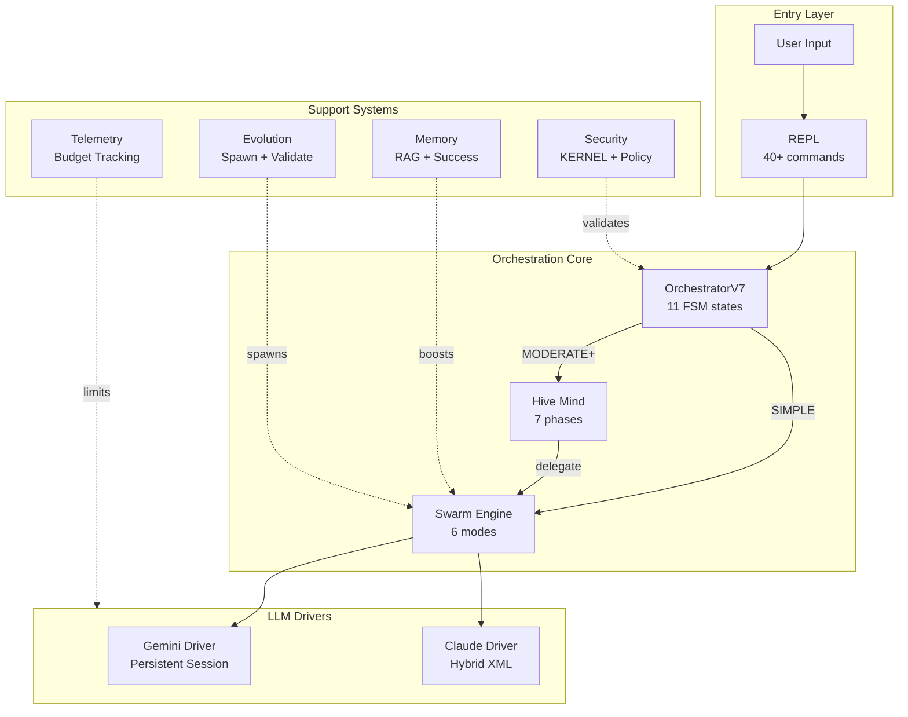
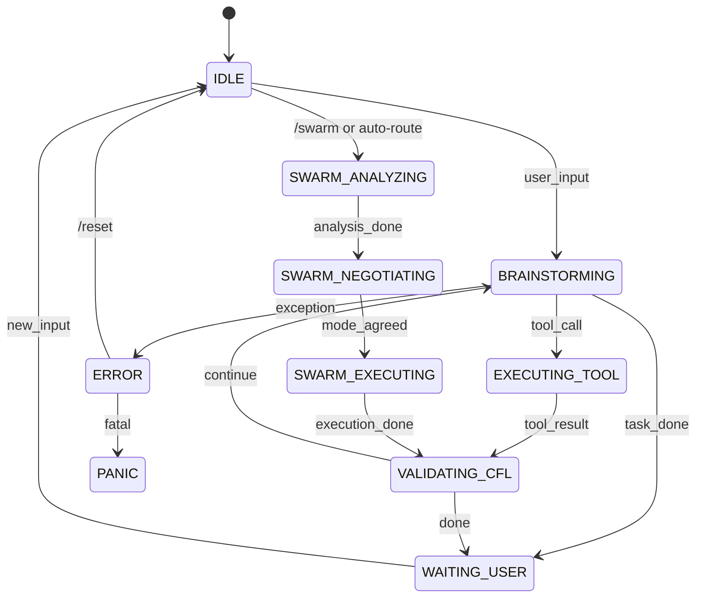
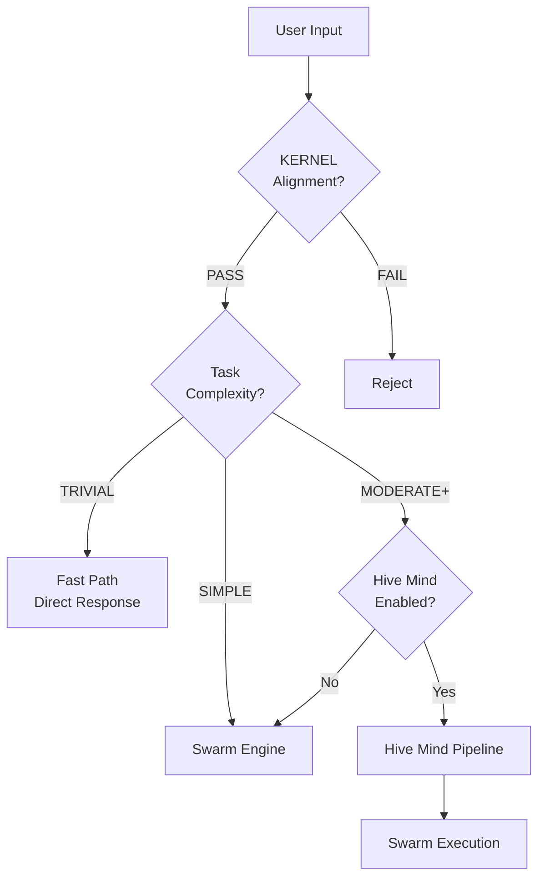
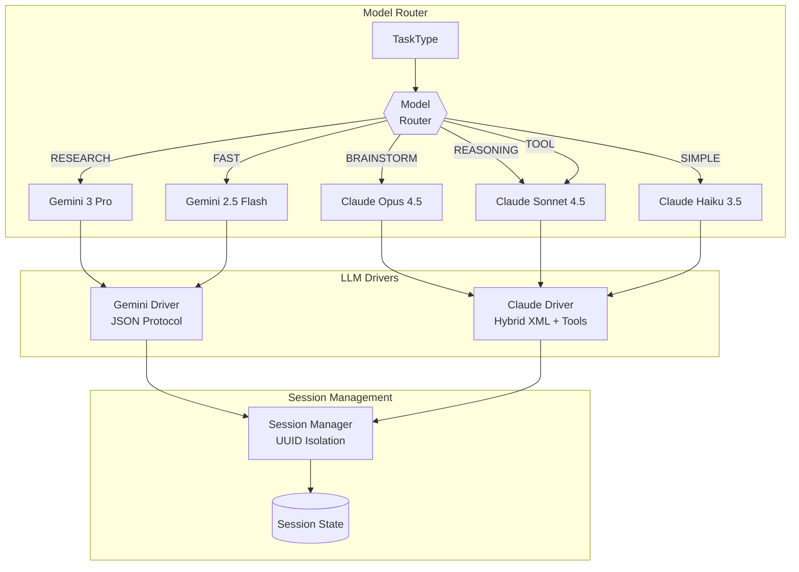
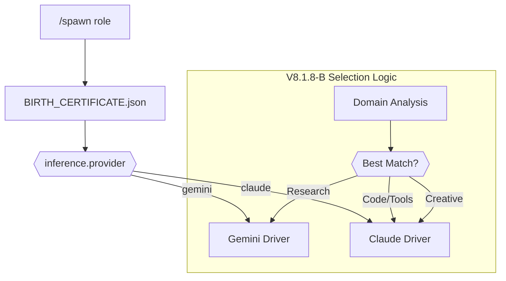
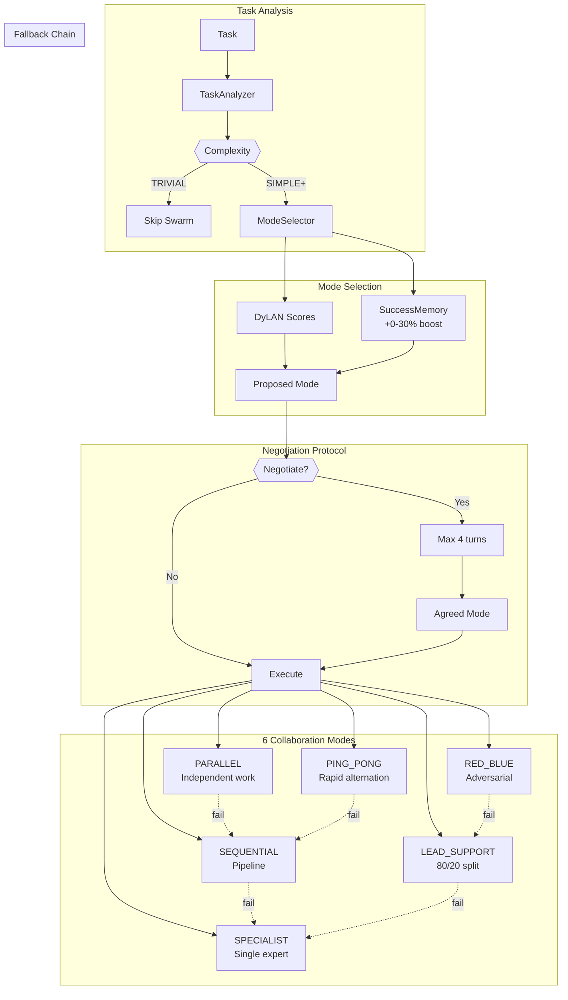
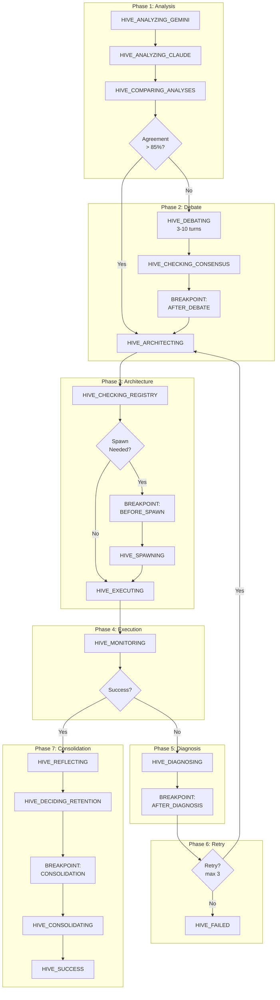
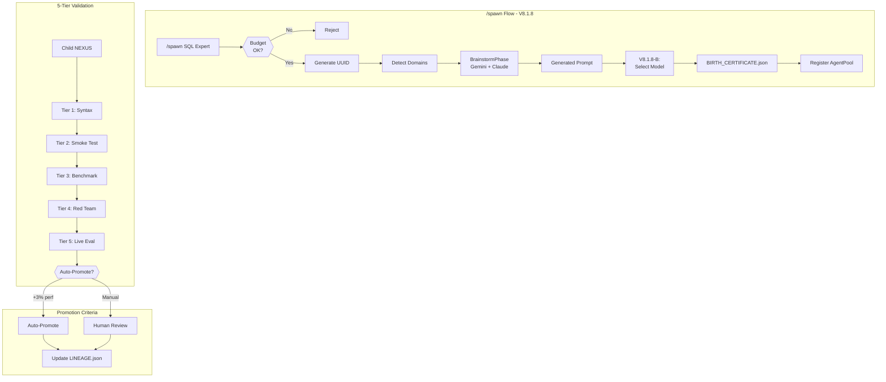
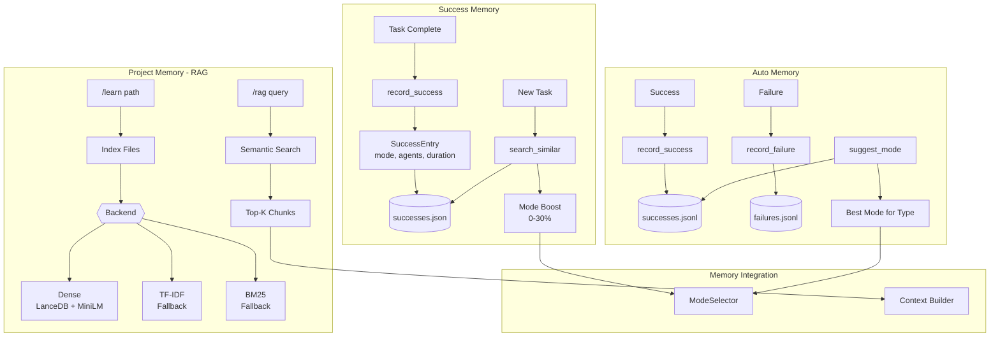
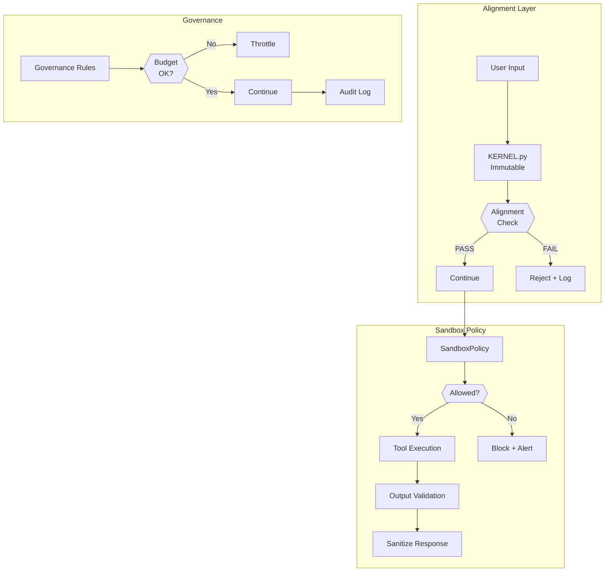

# NEXUS V8.3.2 Architecture Map

**Auto-Generated**: 2025-12-09 21:12
**Git Commit**: cce3557
**Generator**: `scripts/doc_engine.py` V2
**Codename**: "TRUE HIVE MIND"

---

> This document is automatically generated by scanning the codebase.
> It provides a complete, verified view of the NEXUS architecture.

---

## Table of Contents

1. [High-Level Overview](#1-high-level-overview)
2. [ZOOM: Orchestration Core](#2-zoom-orchestration-core)
3. [ZOOM: LLM Drivers & Routing](#3-zoom-llm-drivers--routing)
4. [ZOOM: Swarm Engine](#4-zoom-swarm-engine)
5. [ZOOM: Hive Mind Pipeline](#5-zoom-hive-mind-pipeline)
6. [ZOOM: Evolution & Spawning](#6-zoom-evolution--spawning)
7. [ZOOM: Memory Systems](#7-zoom-memory-systems)
8. [ZOOM: Security & Governance](#8-zoom-security--governance)
9. [Functional Inventory](#9-functional-inventory)
10. [Key Dataclasses](#10-key-dataclasses)
11. [Statistics](#11-statistics)
12. [Anti-Hallucination Reference](#12-anti-hallucination-reference)

---

## 1. HIGH-LEVEL OVERVIEW



### Architecture Summary

| Layer | Components | Purpose |
|-------|------------|---------|
| **Entry** | REPL, Commands | User interaction |
| **Orchestration** | FSM, Router | State management, task routing |
| **Collaboration** | Swarm, Hive Mind | Multi-agent coordination |
| **LLM** | Gemini, Claude | Model execution |
| **Support** | Memory, Security, Evolution, Telemetry | Cross-cutting concerns |


### Component Summary

| Component | Files | LOC | Classes | Functions |
|-----------|-------|-----|---------|-----------|
| hive_mind | 17 | 8,443 | 66 | 202 |
| swarm | 9 | 5,793 | 41 | 165 |
| evolution | 11 | 4,744 | 30 | 104 |
| interface | 3 | 3,285 | 3 | 68 |
| execution | 3 | 2,814 | 9 | 60 |
| memory | 8 | 2,749 | 11 | 92 |
| orchestration | 5 | 2,353 | 6 | 58 |
| security | 4 | 1,585 | 8 | 48 |
| bootstrap | 2 | 1,400 | 5 | 35 |
| mcp | 3 | 1,393 | 21 | 56 |
| drivers | 3 | 1,293 | 4 | 21 |
| telemetry | 3 | 1,235 | 12 | 42 |
| governance | 4 | 1,206 | 7 | 19 |
| fsm | 5 | 1,040 | 6 | 46 |
| utils | 5 | 846 | 3 | 33 |
| workspace | 3 | 591 | 7 | 26 |
| synapse | 2 | 506 | 6 | 23 |
| notifications | 3 | 461 | 1 | 7 |
| logging | 1 | 454 | 3 | 31 |
| routing | 1 | 336 | 3 | 11 |
| meta | 1 | 267 | 1 | 4 |
| adapters | 1 | 237 | 1 | 4 |
| ui | 1 | 224 | 1 | 11 |
| prompts | 1 | 178 | 0 | 6 |
| reasoning | 0 | 0 | 0 | 0 |

## 2. ZOOM: Orchestration Core

### FSM State Diagram



### Decision Points



### Orchestrator States (11 total)

| State | Description |
|-------|-------------|
| `IDLE` | - |
| `BRAINSTORMING` | - |
| `EXECUTING_TOOL` | - |
| `VALIDATING_CFL` | - |
| `EVOLUTION_BRAINSTORM` | - |
| `WAITING_USER` | - |
| `ERROR` | - |
| `PANIC` | - |
| `SWARM_ANALYZING` | - |
| `SWARM_NEGOTIATING` | - |
| `SWARM_EXECUTING` | - |

**Source**: `core/fsm/states.py`


## 3. ZOOM: LLM Drivers & Routing

### Model Selection



### Model Routing Table (Dynamic)

| Task Type | Model | Reasoning |
|-----------|-------|-----------|
| ARCHITECT | Claude Opus 4.5 | Complex reasoning, creativity |
| BRAINSTORM | Claude Opus 4.5 | Complex reasoning, creativity |
| REDTEAM | Claude Opus 4.5 | Complex reasoning, creativity |
| EVOLUTION | Claude Opus 4.5 | Complex reasoning, creativity |
| VALIDATION | Claude Sonnet 4.5 | Speed, tool use |
| FORMAT | Claude Sonnet 4.5 | Speed, tool use |
| SIMPLE | Claude Sonnet 4.5 | Speed, tool use |
| TOOL | Claude Sonnet 4.5 | Speed, tool use |
| REASONING | Gemini 3 Pro | Large context, analysis |
| RESEARCH | Gemini 3 Pro | Large context, analysis |
| ANALYSIS | Gemini 3 Pro | Large context, analysis |

**Claude Tasks**: Opus → architect, brainstorm, redteam, evolution | Sonnet → validation, format, simple, tool
**Gemini Tasks**: Pro → reasoning, brainstorm, research, analysis, evolution | Flash → simple, validation, format, tool

### Spawned Agent Provider Selection



**Source**: `core/routing/model_router.py`, `core/drivers/`


## 4. ZOOM: Swarm Engine

### Task Analysis & Mode Selection



### Collaboration Modes (6)

| Mode | Description | Fallback |
|------|-------------|----------|
| `PARALLEL` | Both agents work simultaneously on independent subtasks | SEQUENTIAL |
| `SEQUENTIAL` | First agent outputs, second agent refines/continues | SPECIALIST |
| `LEAD_SUPPORT` | Lead agent (80%) drives, support agent (20%) reviews | SPECIALIST |
| `PING_PONG` | Rapid alternation, each builds on the other's output | SEQUENTIAL |
| `SPECIALIST` | Single expert handles everything, other observes | None (terminal) |
| `RED_BLUE` | Blue proposes, Red attacks/critiques, iterate to consensus | LEAD_SUPPORT |

### Fallback Chain

| Mode | Fallback To |
|------|-------------|
| `PARALLEL` | `SEQUENTIAL` |
| `SEQUENTIAL` | `SPECIALIST` |
| `LEAD_SUPPORT` | `SPECIALIST` |
| `PING_PONG` | `SEQUENTIAL` |
| `SPECIALIST` | `None` |
| `RED_BLUE` | `LEAD_SUPPORT` |

**Source**: `core/swarm/collaboration_modes.py`, `core/swarm/mode_executors.py`


## 5. ZOOM: Hive Mind Pipeline

### 7-Phase Pipeline



### HiveMind States (24 total)

| Phase | States |
|-------|--------|
| Other | `HIVE_GATING`, `HIVE_COMPARING_ANALYSES`, `HIVE_APPLYING_CHANGES` |
| Phase 1: Analysis | `HIVE_ANALYZING_GEMINI`, `HIVE_ANALYZING_CLAUDE` |
| Phase 2: Debate | `HIVE_DEBATING`, `HIVE_CHECKING_CONSENSUS`, `HIVE_BREAKPOINT_DEBATE` |
| Phase 3: Architecture | `HIVE_ARCHITECTING`, `HIVE_CHECKING_REGISTRY`, `HIVE_BREAKPOINT_SPAWN`, `HIVE_SPAWNING` |
| Phase 4: Execution | `HIVE_EXECUTING`, `HIVE_MONITORING` |
| Phase 5: Diagnosis | `HIVE_DIAGNOSING`, `HIVE_BREAKPOINT_DIAGNOSIS` |
| Phase 6: Retry | `HIVE_DECIDING_RETRY` |
| Phase 7: Consolidation | `HIVE_REFLECTING`, `HIVE_DECIDING_RETENTION`, `HIVE_BREAKPOINT_CONSOLIDATION`, `HIVE_CONSOLIDATING` |
| Terminal | `HIVE_SUCCESS`, `HIVE_FAILED`, `HIVE_ESCALATE` |


### User Breakpoints

| Breakpoint | Location | Purpose |
|------------|----------|---------|
| `AFTER_DEBATE` | After Phase 2 | Review debate consensus |
| `BEFORE_SPAWN` | Before spawning | Approve agent creation |
| `AFTER_DIAGNOSIS` | After failure analysis | Review fix strategy |
| `CONSOLIDATION` | Before knowledge archival | Review learnings |

**Source**: `core/hive_mind/types.py`, `core/hive_mind/phases/`


## 6. ZOOM: Evolution & Spawning

### /spawn Flow



### BIRTH_CERTIFICATE.json Structure

```json
{
  "uuid": "agent-uuid-here",
  "role": "SQL Expert",
  "created_at": "2025-12-09T...",
  "parent_version": "8.3.2",
  "inference": {
    "provider": "claude",
    "model": "claude-sonnet-4-5"
  },
  "domains": ["database", "sql", "optimization"],
  "prompt_hash": "sha256:..."
}
```

### Evolution Commands

| Command | Description |
|---------|-------------|
| `/spawn <role>` | Create specialized agent |
| `/agents` | List all spawned agents |
| `/evolve [count]` | Create child generations |
| `/evolve-status` | Show evolution stats |
| `/review` | Review pending children |
| `/specialize <mission>` | Create NEXUS spinoff |

**Source**: `core/evolution/`, `core/bootstrap/agent_loader.py`


## 7. ZOOM: Memory Systems

### Memory Architecture



### Memory Commands

| Command | Description |
|---------|-------------|
| `/learn [path]` | Index files into RAG |
| `/forget [path]` | Remove from RAG index |
| `/memory-status` | Show index statistics |
| `/rag init` | Index workspace/memory/ |
| `/rag clear` | Clear RAG data |
| `/rag query <text>` | Test retrieval |

### RAG Backends

| Backend | Description | When Used |
|---------|-------------|-----------|
| **Dense (LanceDB)** | Semantic search with MiniLM embeddings | Default, best quality |
| **TF-IDF** | Term frequency-based | Fallback if Dense fails |
| **BM25** | Probabilistic ranking | Alternative fallback |

**Source**: `core/memory/`


## 8. ZOOM: Security & Governance

### Security Architecture



### KERNEL.py (Immutable Alignment)

The KERNEL.py file is the **immutable alignment core** that:
- Cannot be modified by agents
- Validates all operations against alignment rules
- Ensures Creator authority (Yann Abadie)
- Prevents harmful operations

### SandboxPolicy

| Policy | Description |
|--------|-------------|
| **File Access** | Restricted to workspace/ |
| **Network** | Controlled external access |
| **Execution** | Sandboxed command execution |
| **Budget** | Token/cost limits |

### Defense-in-Depth

| Layer | Protection |
|-------|------------|
| 1. KERNEL | Alignment validation |
| 2. Sandbox | Operation restrictions |
| 3. Governance | Budget/rate limits |
| 4. Audit | Full operation logging |

**Source**: `core/security/`, `KERNEL.py`


## 9. FUNCTIONAL INVENTORY

### Slash Commands (0 total)


## 10. KEY DATACLASSES

### Core Dataclasses

| Dataclass | Key Fields | Source |
|-----------|------------|--------|
| `AgentProfile` | agent_id, provider, model, capabilities, is_active (+3 more) | `core\swarm\agent_metrics.py` |
| `DebateResult` | status, final_approach, final_capabilities, final_mode, debate_history (+6 more) | `core\hive_mind\types.py` |
| `ExecutionPlan` | strategy, steps, estimated_total_duration, estimated_total_tokens | `core\hive_mind\types.py` |
| `FailureDiagnosis` | failure_type, root_cause, contributing_factors, evidence, recommended_changes (+4 more) | `core\hive_mind\types.py` |
| `HiveMindResult` | success, output, state, phases_completed, total_duration (+6 more) | `core\hive_mind\orchestrator.py` |
| `InferenceConfig` | provider, model, reasoning | `core\bootstrap\agent_loader.py` |
| `ModeProposal` | mode, confidence, agent_assignments, reasoning, alternatives (+1 more) | `core\swarm\mode_selector.py` |
| `SuccessEntry` | task_id, task_hash, description, swarm_mode, agents_used (+8 more) | `core\memory\success_memory.py` |
| `SwarmDelegationResult` | success, result, mode_used, fallback_chain, failure_diagnostics (+2 more) | `core\hive_mind\swarm_bridge.py` |
| `TaskAnalysis` | complexity, domains, primary_domain, requires_web, requires_code_execution (+7 more) | `core\swarm\task_analyzer.py` |


### All Enums (29 total)

`AgentProvider`, `CollaborationMode`, `CommandType`, `ContextPriority`, `CostCategory`, `EventType`, `EvolutionPhaseStatus`, `ExecutionStatus`, `FailureCategory`, `FailureType`, `HiveMindState`, `HivePhase`, `IssueSeverity`, `LogLevel`, `MCPContentType`, `MetricType`, `NegotiationStatus`, `OrchestratorState`, `RetentionDecision`, `RiskLevel`, `SessionMode`, `SessionStatus`, `SwarmPhase`, `TaskComplexity`, `TaskComplexity` (+4 more)

### All Dataclasses (117 total)

`APICallMetric`, `AgentArchitecture`, `AgentAssignment`, `AgentDebateMetrics`, `AgentInvocationResult`, `AgentPool`, `AgentProfile`, `AgentResponse`, `AgentRetention`, `AgentSession`, `AgentSpec`, `AgentToolDefinition`, `AgentToolResult`, `AnalysisComparison`, `AnalysisPhaseResult`, `ArchitecturePhaseResult`, `ArchiveResult`, `AutoPromotionDecision`, `BlacklistedStrategy`, `BrainstormResult`, `BreakpointOption`, `BreakpointRequest`, `BreakpointResponse`, `BudgetState`, `ChildCreationResult`, `Chunk`, `CodeValidationResult`, `CommandAnalysis`, `CompletionCriteria`, `ConsolidationPhaseResult`...


## 11. STATISTICS

### Codebase Metrics

| Metric | Value |
|--------|-------|
| **Total Components** | 25 |
| **Total Python Files** | 99 |
| **Total Lines of Code** | 43,433 |
| **Total Classes** | 255 |
| **Total Functions** | 1,172 |
| **Total Dataclasses** | 117 |
| **Total Enums** | 29 |

### Test Coverage

| Metric | Value |
|--------|-------|
| **Test Functions** | 1197 |

### Lines of Code by Component

```
hive_mind       | ############################## 8,443
swarm           | #################### 5,793
evolution       | ################ 4,744
interface       | ########### 3,285
execution       | ######### 2,814
memory          | ######### 2,749
orchestration   | ######## 2,353
security        | ##### 1,585
bootstrap       | #### 1,400
mcp             | #### 1,393
drivers         | #### 1,293
telemetry       | #### 1,235
governance      | #### 1,206
fsm             | ### 1,040
utils           | ### 846
```

### Component Distribution

| Component | % of Codebase |
|-----------|---------------|
| hive_mind | 19.4% |
| swarm | 13.3% |
| evolution | 10.9% |
| interface | 7.6% |
| execution | 6.5% |
| memory | 6.3% |
| orchestration | 5.4% |
| security | 3.6% |
| bootstrap | 3.2% |
| mcp | 3.2% |

## 12. ANTI-HALLUCINATION REFERENCE

### Verified Structures

This section provides **verified** structures for AI agents to reference, preventing hallucination.

#### OrchestratorState (VERIFIED)

```python
# core/fsm/states.py
class OrchestratorState(Enum):
    IDLE = "IDLE"
    BRAINSTORMING = "BRAINSTORMING"
    EXECUTING_TOOL = "EXECUTING_TOOL"
    VALIDATING_CFL = "VALIDATING_CFL"
    EVOLUTION_BRAINSTORM = "EVOLUTION_BRAINSTORM"
    WAITING_USER = "WAITING_USER"
    ERROR = "ERROR"
    PANIC = "PANIC"
    SWARM_ANALYZING = "SWARM_ANALYZING"
    SWARM_NEGOTIATING = "SWARM_NEGOTIATING"
    SWARM_EXECUTING = "SWARM_EXECUTING"
```

#### HiveMindState (VERIFIED - 24 states)

```python
# core/hive_mind/types.py - First 15 states
    HIVE_GATING
    HIVE_ANALYZING_GEMINI
    HIVE_ANALYZING_CLAUDE
    HIVE_COMPARING_ANALYSES
    HIVE_DEBATING
    HIVE_CHECKING_CONSENSUS
    HIVE_BREAKPOINT_DEBATE
    HIVE_ARCHITECTING
    HIVE_CHECKING_REGISTRY
    HIVE_BREAKPOINT_SPAWN
    HIVE_SPAWNING
    HIVE_EXECUTING
    HIVE_MONITORING
    HIVE_DIAGNOSING
    HIVE_BREAKPOINT_DIAGNOSIS
    # ... +9 more
```

#### CollaborationMode (VERIFIED)

```python
# core/swarm/collaboration_modes.py
class CollaborationMode(Enum):
    PARALLEL = "parallel"
    SEQUENTIAL = "sequential"
    LEAD_SUPPORT = "lead_support"
    PING_PONG = "ping_pong"
    SPECIALIST = "specialist"
    RED_BLUE = "red_blue"
```

### Common Hallucination Traps

| Wrong | Correct |
|-------|---------|
| `TaskAnalysis.reasoning` | Use `ModeProposal.reasoning` |
| `ModeProposal.recommended_mode` | Use `.mode` |
| `HiveMindState.HIVE_COMPLETE` | Use `HIVE_SUCCESS` |
| `invoke(task_type=)` | Use `invoke(session_uuid=)` |

### Reference Documents

| Document | Purpose |
|----------|---------|
| `docs/DATACLASS_FIELDS.md` | Exact field definitions |
| `docs/DRIVER_INTERNALS.md` | LLM driver implementation |
| `docs/ASYNC_MAP.md` | Async vs sync functions |


---

## Regeneration

To regenerate this document after code changes:

```bash
python scripts/doc_engine.py --gen-map --apply
```

Or run the full documentation sync:

```bash
python scripts/doc_engine.py --full --apply
```

---

*Generated by NEXUS Documentation Engine V2*
*Source: `scripts/doc_engine.py`*
*Version: 8.3.2 "TRUE HIVE MIND"*
