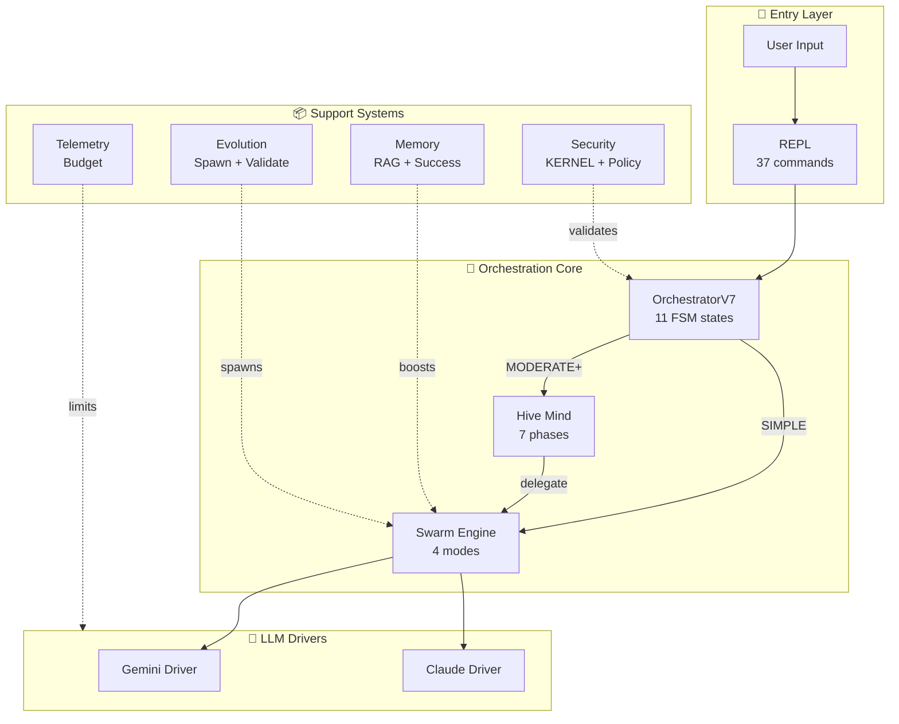
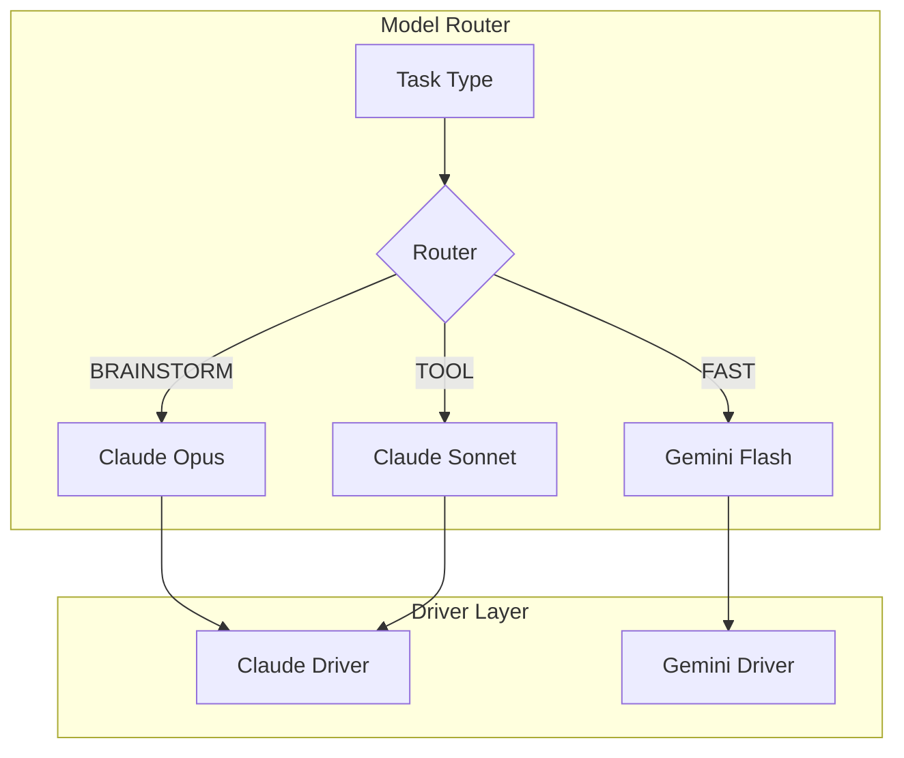
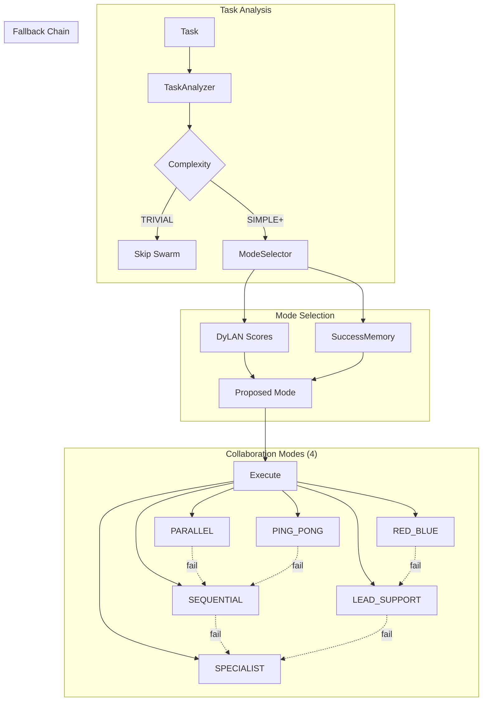

# NEXUS VUnknown Architecture Map

**Auto-Generated**: 2025-12-09 18:37
**Git Commit**: ca633a6
**Generator**: `scripts/generate_architecture_map.py`

---

> This document is automatically generated by scanning the codebase.
> Re-run the generator after significant changes to keep it updated.

---

## 1. HIGH-LEVEL OVERVIEW



### Component Summary

| Component | Files | LOC | Classes | Functions |
|-----------|-------|-----|---------|-----------|
| adapters | 2 | 250 | 1 | 4 |
| bootstrap | 3 | 1,422 | 5 | 35 |
| drivers | 4 | 1,294 | 3 | 19 |
| evolution | 13 | 4,861 | 30 | 104 |
| execution | 4 | 2,815 | 9 | 58 |
| fsm | 6 | 1,044 | 6 | 46 |
| governance | 6 | 1,276 | 7 | 19 |
| hive_mind | 19 | 8,601 | 66 | 202 |
| interface | 4 | 3,286 | 3 | 65 |
| logging | 2 | 482 | 3 | 31 |
| mcp | 4 | 1,446 | 21 | 56 |
| memory | 10 | 2,833 | 11 | 92 |
| meta | 2 | 268 | 1 | 4 |
| notifications | 4 | 478 | 1 | 7 |
| orchestration | 6 | 2,401 | 6 | 58 |
| prompts | 2 | 187 | 0 | 5 |
| reasoning | 1 | 50 | 0 | 0 |
| routing | 2 | 346 | 3 | 11 |
| security | 5 | 1,613 | 8 | 48 |
| swarm | 10 | 5,978 | 41 | 163 |
| synapse | 3 | 507 | 6 | 23 |
| telemetry | 4 | 1,269 | 12 | 42 |
| ui | 2 | 225 | 1 | 11 |
| utils | 6 | 894 | 3 | 33 |
| workspace | 4 | 628 | 7 | 26 |

## 2. ZOOM: Orchestration Core

```mermaid
stateDiagram-v2
    [*] --> IDLE

    IDLE --> BRAINSTORMING: user_input
    IDLE --> SWARM_ANALYZING: /swarm

    BRAINSTORMING --> EXECUTING_TOOL: tool_call
    BRAINSTORMING --> WAITING_USER: task_done

    EXECUTING_TOOL --> VALIDATING_CFL: result
    VALIDATING_CFL --> BRAINSTORMING: continue
    VALIDATING_CFL --> WAITING_USER: done

    SWARM_ANALYZING --> SWARM_NEGOTIATING: analyzed
    SWARM_NEGOTIATING --> SWARM_EXECUTING: agreed
    SWARM_EXECUTING --> VALIDATING_CFL: executed

    WAITING_USER --> IDLE: new_input

    BRAINSTORMING --> ERROR: exception
    ERROR --> IDLE: /reset
    ERROR --> PANIC: fatal

    note right of IDLE: States found: 11
```

### FSM States Discovered

**OrchestratorState** (`core/fsm/states.py`):
`IDLE`, `BRAINSTORMING`, `EXECUTING_TOOL`, `VALIDATING_CFL`, `EVOLUTION_BRAINSTORM`, `WAITING_USER`, `ERROR`, `PANIC`, `SWARM_ANALYZING`, `SWARM_NEGOTIATING` ... (+1 more)

**HiveMindState** (`core/hive_mind/types.py`):
`HIVE_GATING`, `HIVE_ANALYZING_GEMINI`, `HIVE_ANALYZING_CLAUDE`, `HIVE_COMPARING_ANALYSES`, `HIVE_DEBATING`, `HIVE_CHECKING_CONSENSUS`, `HIVE_BREAKPOINT_DEBATE`, `HIVE_ARCHITECTING`, `HIVE_CHECKING_REGISTRY`, `HIVE_BREAKPOINT_SPAWN` ... (+14 more)


### Key Files
| File | Role |
|------|------|
| `core/orchestration_v7.py` | Main orchestrator |
| `core/fsm/states.py` | State definitions |
| `core/orchestration/fsm_handlers.py` | State handlers |

## 3. ZOOM: LLM Drivers & Routing



### Drivers Discovered

| Class | File |
|-------|------|
| `ClaudeDriverHybrid` | `core/drivers/claude_driver_hybrid.py` |
| `AsyncDriverAdapter` | `core/drivers/async_adapter.py` |
| `GeminiDriverV7` | `core/drivers/gemini_driver_v7.py` |


## 4. ZOOM: Swarm Engine



### Collaboration Modes Discovered

| Mode | Source |
|------|--------|
| `FRESH` | `core/swarm/session_manager.py` |
| `CONTINUE` | `core/swarm/session_manager.py` |
| `BRANCH` | `core/swarm/session_manager.py` |
| `EPHEMERAL` | `core/swarm/session_manager.py` |


## 5. ZOOM: Hive Mind Pipeline

```mermaid
graph TD
    subgraph Phase1["Phase 1: Analysis"]
        P1A[Gemini Analysis] --> P1B[Claude Analysis]
        P1B --> P1C{Agreement > 85%?}
    end

    subgraph Phase2["Phase 2: Debate"]
        P1C -->|No| P2A[Debate 3-10 turns]
        P2A --> P2B[Check Consensus]
        P2B --> BP1[🔴 BREAKPOINT]
    end

    subgraph Phase3["Phase 3: Architecture"]
        P1C -->|Yes| P3A
        BP1 --> P3A[Generate Plan]
        P3A --> P3B{Spawn Needed?}
        P3B -->|Yes| BP2[🔴 BREAKPOINT]
        BP2 --> P3C[Spawn Agents]
    end

    subgraph Phase4["Phase 4: Execution"]
        P3B -->|No| P4A
        P3C --> P4A[Execute Steps]
        P4A --> P4B[Monitor]
        P4B --> P4C{Success?}
    end

    subgraph Phase5["Phase 5: Diagnosis"]
        P4C -->|No| P5A[Diagnose Failure]
        P5A --> BP3[🔴 BREAKPOINT]
    end

    subgraph Phase6["Phase 6: Retry"]
        BP3 --> P6A{Retry? max 3}
        P6A -->|Yes| P3A
        P6A -->|No| FAIL[HIVE_FAILED]
    end

    subgraph Phase7["Phase 7: Consolidation"]
        P4C -->|Yes| P7A[Reflect]
        P7A --> P7B[Archive Knowledge]
        P7B --> SUCCESS[HIVE_SUCCESS]
    end

    note right of Phase1: Phases found: 7
```

### Phases Discovered

| Phase | File |
|-------|------|
| Analysis | `core/hive_mind/phases/phase_analysis.py` |
| Architecture | `core/hive_mind/phases/phase_architecture.py` |
| Consolidation | `core/hive_mind/phases/phase_consolidation.py` |
| Debate | `core/hive_mind/phases/phase_debate.py` |
| Diagnosis | `core/hive_mind/phases/phase_diagnosis.py` |
| Execution | `core/hive_mind/phases/phase_execution.py` |
| Retry | `core/hive_mind/phases/phase_retry.py` |


## 6. ZOOM: Evolution & Spawning

```mermaid
graph TD
    subgraph Spawn["/spawn Flow"]
        CMD[/spawn role] --> BUDGET{Budget OK?}
        BUDGET -->|Yes| UUID[Generate UUID]
        UUID --> BRAIN[Brainstorm Prompt]
        BRAIN --> CERT[BIRTH_CERTIFICATE]
        CERT --> POOL[Register Agent]
    end

    subgraph Validation["5-Tier Validation"]
        CHILD[Child] --> T1[Syntax]
        T1 --> T2[Smoke Test]
        T2 --> T3[Benchmark]
        T3 --> T4[Red Team]
        T4 --> T5[Live Eval]
    end
```

### Evolution Files

| File | Size |
|------|------|
| `lineage.py` | 443 LOC |
| `rate_limiter.py` | 149 LOC |
| `validator.py` | 732 LOC |
| `tiered_validator.py` | 562 LOC |
| `mutation_parser.py` | 463 LOC |
| `manager.py` | 556 LOC |
| `__init__.py` | 90 LOC |
| `models.py` | 149 LOC |
| `evaluator.py` | 542 LOC |
| `promote.py` | 366 LOC |
| `brainstorm.py` | 456 LOC |
| `create.py` | 326 LOC |
| `__init__.py` | 27 LOC |


## 7. ZOOM: Memory Systems

```mermaid
graph TD
    subgraph RAG["Project Memory - RAG"]
        LEARN[/learn path] --> INDEX[Index Files]
        INDEX --> BACKEND{Backend}
        BACKEND --> DENSE[Dense<br/>LanceDB]
        BACKEND --> TFIDF[TF-IDF]
        BACKEND --> BM25[BM25]
        QUERY[/rag query] --> SEARCH[Semantic Search]
        SEARCH --> CHUNKS[Top-K Chunks]
    end

    subgraph Success["Success Memory"]
        DONE[Task Complete] --> RECORD[record_success]
        RECORD --> STORE[(successes.json)]
        NEW[New Task] --> SIMILAR[search_similar]
        SIMILAR --> STORE
        SIMILAR --> BOOST[Mode Boost 0-30%]
    end

    subgraph Integration["Integration"]
        BOOST --> SELECTOR[ModeSelector]
        CHUNKS --> CONTEXT[Context Builder]
    end
```

### Memory Backends

| Backend | Purpose |
|---------|---------|
| Dense (LanceDB) | Semantic similarity |
| TF-IDF | Lexical fallback |
| BM25 | Keyword search |
| SuccessMemory | Pattern learning |

## 8. FUNCTIONAL INVENTORY

### Slash Commands (37 total)

**🐝 Collaboration**
- `/swarm <task>`
- `/swarm-status`
- `/swarm-fsm <task>`
- `/pool-stats`

**🧬 Evolution**
- `/evolve [count]`
- `/evolve-status`
- `/review`
- `/specialize <mission>`
- `/spawn <role>`
- `/agents`

**📊 Monitoring**
- `/status`
- `/telemetry`
- `/telemetry status`
- `/telemetry export [days]`
- `/budget`
- `/budget reset`
- `/budget add <amount>`
- `/budget history`

**📁 Workspace**
- `/workspace`
- `/workspace new [name]`
- `/workspace list`
- `/workspace switch <name>`
- `/bootstrap [path]`

**🧠 Memory**
- `/learn [path]`
- `/forget [path]`
- `/memory-status`
- `/rag init`
- `/rag clear`
- `/rag query <text>`

**⚙️ System**
- `/clear`
- `/reset`
- `/doctor`
- `/mode <name>`
- `/chat`
- `/help`
- `/tutorial`
- `/quickstart`


### Dataclasses by Component (117 total)

**bootstrap**: `InferenceConfig`, `SpawnedAgentConfig`, `ProjectAnalysis`

**evolution**: `ValidationResult`, `FullValidationResult`, `SafetyGate`, `AutoPromotionDecision`, `TierResult` (+13 more)

**execution**: `AgentToolDefinition`, `AgentToolResult`, `ToolCreationResult`, `ToolExecutionResult`, `ToolMetadata`

**fsm**: `TaskExecutionContext`

**governance**: `QuestionResult`, `ValidationResult`, `TrapQuestion`

**hive_mind**: `DebateParams`, `AgentDebateMetrics`, `HiveMindResult`, `PseudoExecutionResult`, `HiveMindAnalysisAdapter` (+36 more)

**interface**: `TutorialStep`

**mcp**: `MCPClientState`, `MCPServerConfig`, `MCPRequest`, `MCPError`, `MCPResponse` (+7 more)

**memory**: `SuccessEntry`, `MemoryEntry`, `Chunk`, `IndexStats`

**routing**: `RoutingDecision`

**security**: `CommandAnalysis`, `CodeValidationResult`

**swarm**: `AgentSession`, `TaskSession`, `AgentInvocationResult`, `AgentProfile`, `AgentPool` (+13 more)

**telemetry**: `APICallMetric`, `SwarmTaskMetric`, `SessionMetric`, `BudgetState`, `CostRecord` (+1 more)

**workspace**: `WorkspaceMetrics`, `WorkspaceInfo`


### Enums Discovered (29 total)

`ValidationTier`, `EvolutionPhaseStatus`, `OrchestratorState`, `RiskLevel`, `TaskComplexity`, `HiveMindState`, `UserBreakpoint`, `RetentionDecision`, `IssueSeverity`, `FailureType`, `CostCategory`, `HivePhase`, `ContextPriority`, `FailureCategory`, `LogLevel`, `EventType`, `MCPContentType`, `TaskType`, `CommandType`, `SessionStatus`, `SessionMode`, `AgentProvider`, `NegotiationStatus`, `TaskComplexity`, `TaskDomain`, `CollaborationMode`, `ExecutionStatus`, `SwarmPhase`, `MetricType`

## 9. STATISTICS

| Metric | Value |
|--------|-------|
| **Total Components** | 25 |
| **Total Python Files** | 131 |
| **Total Lines of Code** | 45,576 |
| **Total Classes** | 256 |
| **Total Dataclasses** | 117 |
| **Total Enums** | 29 |

### Lines of Code by Component

```
hive_mind     | ██████████████████████████████ 8,601
swarm         | ████████████████████ 5,978
evolution     | ████████████████ 4,861
interface     | ███████████ 3,286
memory        | █████████ 2,833
execution     | █████████ 2,815
orchestration | ████████ 2,401
security      | █████ 1,613
mcp           | █████ 1,446
bootstrap     | ████ 1,422
drivers       | ████ 1,294
governance    | ████ 1,276
telemetry     | ████ 1,269
fsm           | ███ 1,044
utils         | ███ 894
```

---

## Regeneration

To regenerate this document after code changes:

```bash
python scripts/generate_architecture_map.py --output docs/ARCHITECTURE_MAP_GENERATED.md
```

---

*Generated by NEXUS Architecture Map Generator*
*Source: `scripts/generate_architecture_map.py`*