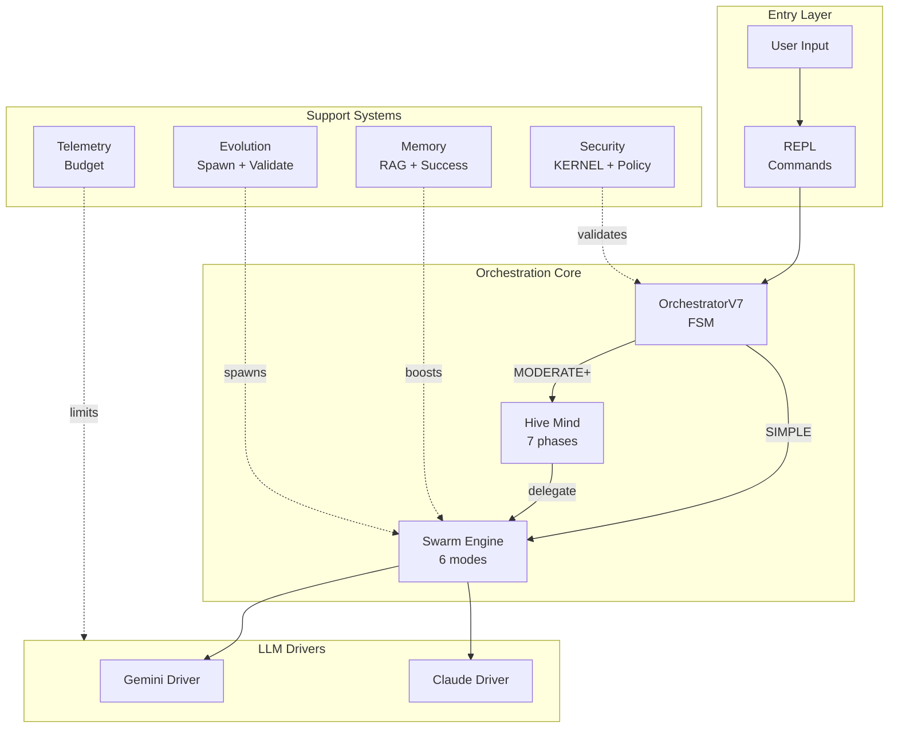
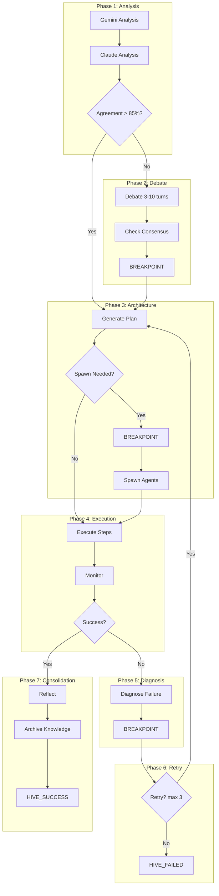

# NEXUS V8.3.2 Architecture Map

**Auto-Generated**: 2025-12-09 19:54
**Git Commit**: ca633a6
**Generator**: `scripts/doc_engine.py`

---

> This document is automatically generated by scanning the codebase.
> Re-run the generator after significant changes to keep it updated.

---

## 1. HIGH-LEVEL OVERVIEW



### Component Summary

| Component | Files | LOC | Classes | Functions |
|-----------|-------|-----|---------|-----------
| adapters | 1 | 237 | 1 | 4 |
| bootstrap | 2 | 1,400 | 5 | 35 |
| drivers | 3 | 1,293 | 4 | 21 |
| evolution | 11 | 4,744 | 30 | 104 |
| execution | 3 | 2,814 | 9 | 60 |
| fsm | 5 | 1,040 | 6 | 46 |
| governance | 4 | 1,206 | 7 | 19 |
| hive_mind | 17 | 8,443 | 66 | 202 |
| interface | 3 | 3,285 | 3 | 68 |
| logging | 1 | 454 | 3 | 31 |
| mcp | 3 | 1,393 | 21 | 56 |
| memory | 8 | 2,749 | 11 | 92 |
| meta | 1 | 267 | 1 | 4 |
| notifications | 3 | 461 | 1 | 7 |
| orchestration | 5 | 2,353 | 6 | 58 |
| prompts | 1 | 178 | 0 | 6 |
| reasoning | 0 | 0 | 0 | 0 |
| routing | 1 | 336 | 3 | 11 |
| security | 4 | 1,585 | 8 | 48 |
| swarm | 9 | 5,793 | 41 | 165 |
| synapse | 2 | 506 | 6 | 23 |
| telemetry | 3 | 1,235 | 12 | 42 |
| ui | 1 | 224 | 1 | 11 |
| utils | 5 | 846 | 3 | 33 |
| workspace | 3 | 591 | 7 | 26 |

## 2. ZOOM: Orchestration Core

```mermaid
stateDiagram-v2
    [*] --> IDLE

    IDLE --> BRAINSTORMING: user_input
    IDLE --> SWARM_ANALYZING: /swarm

    BRAINSTORMING --> EXECUTING_TOOL: tool_call
    BRAINSTORMING --> WAITING_USER: task_done

    EXECUTING_TOOL --> VALIDATING_CFL: result
    VALIDATING_CFL --> BRAINSTORMING: continue
    VALIDATING_CFL --> WAITING_USER: done

    SWARM_ANALYZING --> SWARM_NEGOTIATING: analyzed
    SWARM_NEGOTIATING --> SWARM_EXECUTING: agreed
    SWARM_EXECUTING --> VALIDATING_CFL: executed

    WAITING_USER --> IDLE: new_input

    BRAINSTORMING --> ERROR: exception
    ERROR --> IDLE: /reset
    ERROR --> PANIC: fatal

    note right of IDLE: States found: 11
```

### FSM States Discovered

**OrchestratorState** (`core/fsm/states.py`):
`IDLE`, `BRAINSTORMING`, `EXECUTING_TOOL`, `VALIDATING_CFL`, `EVOLUTION_BRAINSTORM`, `WAITING_USER`, `ERROR`, `PANIC`, `SWARM_ANALYZING`, `SWARM_NEGOTIATING` ... (+1 more)

## 3. ZOOM: Swarm Engine


### Collaboration Modes Discovered

| Mode | Source |
|------|--------|
| `PARALLEL` | `core/swarm/collaboration_modes.py` |
| `SEQUENTIAL` | `core/swarm/collaboration_modes.py` |
| `LEAD_SUPPORT` | `core/swarm/collaboration_modes.py` |
| `PING_PONG` | `core/swarm/collaboration_modes.py` |
| `SPECIALIST` | `core/swarm/collaboration_modes.py` |
| `RED_BLUE` | `core/swarm/collaboration_modes.py` |

## 4. ZOOM: Hive Mind Pipeline



### HiveMind States Discovered

**HiveMindState** (`core/hive_mind/types.py`):
`HIVE_GATING`, `HIVE_ANALYZING_GEMINI`, `HIVE_ANALYZING_CLAUDE`, `HIVE_COMPARING_ANALYSES`, `HIVE_DEBATING`, `HIVE_CHECKING_CONSENSUS`, `HIVE_BREAKPOINT_DEBATE`, `HIVE_ARCHITECTING`, `HIVE_CHECKING_REGISTRY`, `HIVE_BREAKPOINT_SPAWN` ... (+14 more)

## 5. ZOOM: Memory Systems

```mermaid
graph TD
    subgraph RAG["Project Memory - RAG"]
        LEARN[/learn path] --> INDEX[Index Files]
        INDEX --> BACKEND{Backend}
        BACKEND --> DENSE[Dense<br/>LanceDB]
        BACKEND --> TFIDF[TF-IDF]
        BACKEND --> BM25[BM25]
        QUERY[/rag query] --> SEARCH[Semantic Search]
        SEARCH --> CHUNKS[Top-K Chunks]
    end

    subgraph Success["Success Memory"]
        DONE[Task Complete] --> RECORD[record_success]
        RECORD --> STORE[(successes.json)]
        NEW[New Task] --> SIMILAR[search_similar]
        SIMILAR --> STORE
        SIMILAR --> BOOST[Mode Boost 0-30%]
    end

    subgraph Integration["Integration"]
        BOOST --> SELECTOR[ModeSelector]
        CHUNKS --> CONTEXT[Context Builder]
    end
```

## 6. FUNCTIONAL INVENTORY

### Slash Commands (28 discovered)

- `/agents`
- `/bootstrap`
- `/budget`
- `/chat`
- `/clear`
- `/doctor`
- `/evolve`
- `/evolve-status`
- `/exit`
- `/forget`
- `/help`
- `/learn`
- `/memory-status`
- `/mode`
- `/pool-stats`
- `/quickstart`
- `/rag`
- `/reset`
- `/review`
- `/spawn`
- `/specialize`
- `/status`
- `/swarm`
- `/swarm-fsm`
- `/swarm-status`
- `/telemetry`
- `/tutorial`
- `/workspace`

### Enums Discovered (28 total)

`AgentProvider`, `CollaborationMode`, `CommandType`, `ContextPriority`, `CostCategory`, `EventType`, `EvolutionPhaseStatus`, `ExecutionStatus`, `FailureCategory`, `FailureType`, `HiveMindState`, `HivePhase`, `IssueSeverity`, `LogLevel`, `MCPContentType`, `MetricType`, `NegotiationStatus`, `OrchestratorState`, `RetentionDecision`, `RiskLevel`...

### Dataclasses Discovered (113 total)

`APICallMetric`, `AgentArchitecture`, `AgentAssignment`, `AgentDebateMetrics`, `AgentInvocationResult`, `AgentPool`, `AgentProfile`, `AgentResponse`, `AgentRetention`, `AgentSession`, `AgentSpec`, `AgentToolDefinition`, `AgentToolResult`, `AnalysisComparison`, `AnalysisPhaseResult`, `ArchitecturePhaseResult`, `ArchiveResult`, `AutoPromotionDecision`, `BlacklistedStrategy`, `BrainstormResult`...

## 7. STATISTICS

| Metric | Value |
|--------|-------|
| **Total Components** | 25 |
| **Total Python Files** | 99 |
| **Total Lines of Code** | 43,433 |
| **Total Classes** | 255 |
| **Total Dataclasses** | 113 |
| **Total Enums** | 28 |

### Lines of Code by Component

```
hive_mind       | ############################## 8,443
swarm           | #################### 5,793
evolution       | ################ 4,744
interface       | ########### 3,285
execution       | ######### 2,814
memory          | ######### 2,749
orchestration   | ######## 2,353
security        | ##### 1,585
bootstrap       | #### 1,400
mcp             | #### 1,393
drivers         | #### 1,293
telemetry       | #### 1,235
governance      | #### 1,206
fsm             | ### 1,040
utils           | ### 846
```

---

## Regeneration

To regenerate this document after code changes:

```bash
python scripts/doc_engine.py --gen-map --apply
```

Or run the full documentation sync:

```bash
python scripts/doc_engine.py --full --apply
```

---

*Generated by NEXUS Documentation Engine*
*Source: `scripts/doc_engine.py`*
