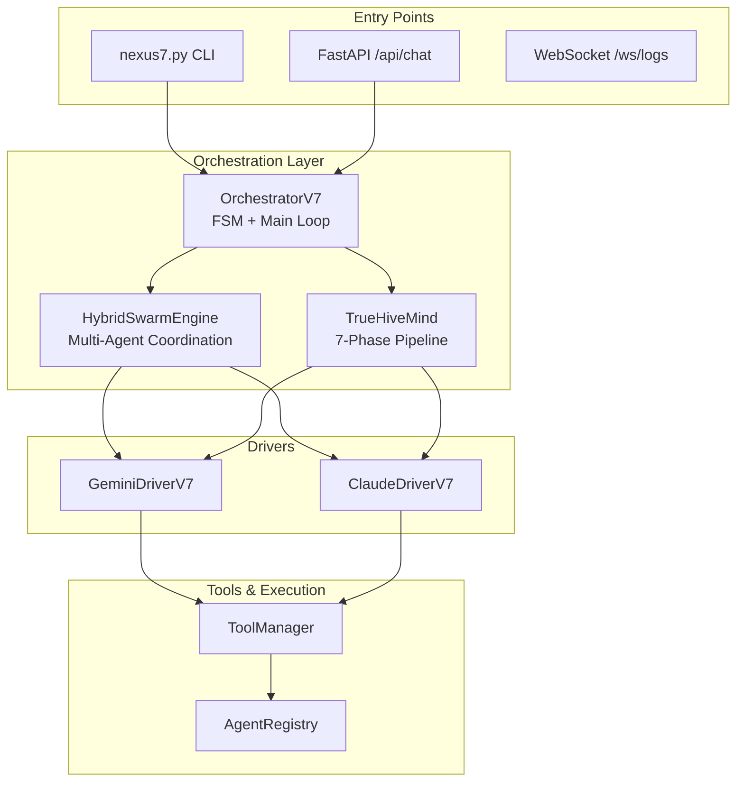
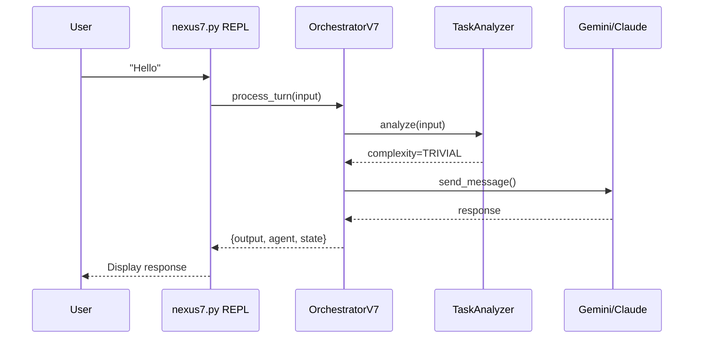
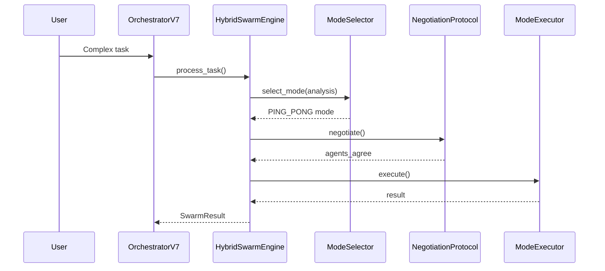
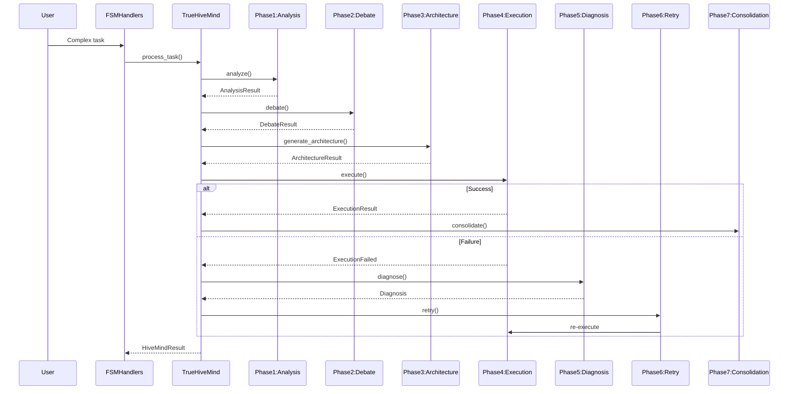
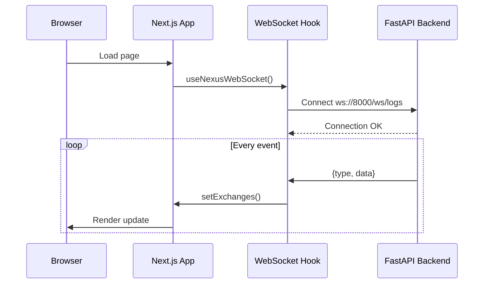
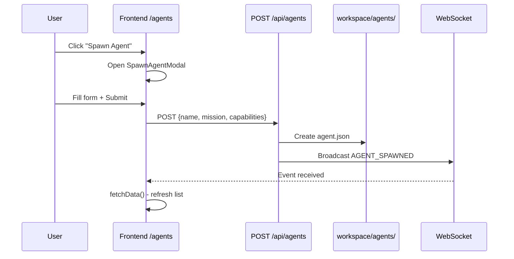
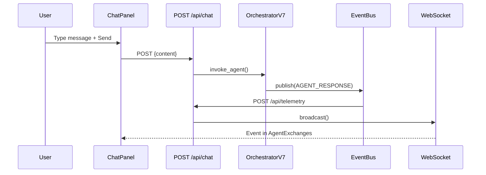

# NEXUS Workflow Map

> Generated: 2025-12-16

## Architecture Overview

---

## Backend Flows

### 1. User Message Flow (Simple Task)

### 2. Swarm Flow (Moderate Task)

### 3. HiveMind Flow (Complex Task)

---

## Frontend Flows

### 4. Dashboard Connection Flow

### 5. Frontend Routes
| Route | Component | Purpose |
|-------|-----------|---------|
| `/` | page.tsx | Dashboard overview |
| `/chat` | ChatPanel + AgentExchanges | Chat interface |
| `/hivemind` | HiveMindTracker + DebateViewer | Phase visualization |
| `/agents` | AgentConstellation + SpawnModal | Agent management |
| `/analytics` | BudgetGauge + EvolutionTree | Metrics |
| `/settings` | Settings form | Configuration |

---

## E2E Flows

### 6. Spawn Agent Flow

### 7. Chat Message Flow

---

## Module Inventory

### Backend Core Modules (30)
| Module | Purpose | Has README |
|--------|---------|------------|
| `adapters/` | External service adapters | ❌ |
| `agents/` | Agent registry & descriptors | ❌ |
| `api/` | Internal API definitions | ✅ |
| `async_primitives/` | Async utilities | ❌ |
| `bootstrap/` | Startup & agent discovery | ❌ |
| `drivers/` | Gemini/Claude drivers | ❌ |
| `evolution/` | Self-improvement system | ❌ |
| `execution/` | Tool execution layer | ❌ |
| `fsm/` | Finite State Machine | ❌ |
| `governance/` | Rate limiting, policies | ❌ |
| `hive_mind/` | 7-phase orchestration | ✅ |
| `interface/` | CLI commands | ❌ |
| `io/` | File I/O primitives | ✅ |
| `logging/` | Structured logging | ❌ |
| `mcp/` | Model Context Protocol | ❌ |
| `memory/` | RAG & knowledge base | ❌ |
| `meta/` | Metaprogramming utils | ❌ |
| `notifications/` | Alert system | ❌ |
| `orchestration/` | Agent invoker, context | ❌ |
| `prompts/` | System prompts | ❌ |
| `reasoning/` | Chain-of-thought | ❌ |
| `routing/` | Model routing | ❌ |
| `security/` | Input/output guards | ❌ |
| `swarm/` | Multi-agent collaboration | ✅ |
| `synapse/` | Blackboard memory | ❌ |
| `telemetry/` | Metrics & budget | ❌ |
| `ui/` | Dashboard server | ❌ |
| `utils/` | Helper functions | ❌ |
| `workspace/` | Project management | ❌ |

### Frontend Modules (5)
| Module | Purpose | Has README |
|--------|---------|------------|
| `app/` | Next.js routes | ❌ |
| `components/` | UI components | ❌ |
| `hooks/` | Custom React hooks | ❌ |
| `lib/` | API client, design tokens | ❌ |
| `stores/` | Global state (chat) | ❌ |

---

*This document will be expanded as Phase 4 progresses.*
