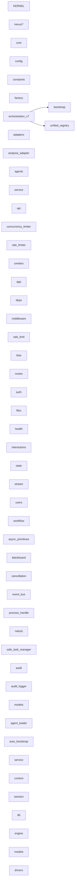

# NEXUS Dependency Graph

```mermaid
flowchart LR
    KERNEL[KERNEL]
    nexus7[nexus7]
    core[core]
    core_config[config]
    core_constants[constants]
    core_factory[factory]
    core_orchestration_v7[orchestration_v7]
    core_adapters[adapters]
    core_adapters_analysis_adapter[analysis_adapter]
    core_agents[agents]
    core_agents_service[service]
    core_agents_unified_registry[unified_registry]
    core_api[api]
    core_api_concurrency_limiter[concurrency_limiter]
    core_api_rate_limiter[rate_limiter]
    core_api_cerebro[cerebro]
    core_api_cerebro_app[app]
    core_api_cerebro_deps[deps]
    core_api_cerebro_middleware[middleware]
    core_api_cerebro_rate_limit[rate_limit]
    core_api_cerebro_rbac[rbac]
    core_api_cerebro_routes[routes]
    core_api_cerebro_routes_auth[auth]
    core_api_cerebro_routes_files[files]
    core_api_cerebro_routes_health[health]
    core_api_cerebro_routes_interactions[interactions]
    core_api_cerebro_routes_state[state]
    core_api_cerebro_routes_stream[stream]
    core_api_cerebro_routes_users[users]
    core_api_cerebro_routes_workflow[workflow]
    core_async_primitives[async_primitives]
    core_async_primitives_blackboard[blackboard]
    core_async_primitives_cancellation[cancellation]
    core_async_primitives_event_bus[event_bus]
    core_async_primitives_process_handle[process_handle]
    core_async_primitives_rwlock[rwlock]
    core_async_primitives_safe_task_manager[safe_task_manager]
    core_audit[audit]
    core_audit_audit_logger[audit_logger]
    core_audit_models[models]
    core_bootstrap[bootstrap]
    core_bootstrap_agent_loader[agent_loader]
    core_bootstrap_auto_bootstrap[auto_bootstrap]
    core_bootstrap_service[service]
    core_context[context]
    core_context_session[session]
    core_db[db]
    core_db_engine[engine]
    core_db_models[models]
    core_drivers[drivers]
    core_orchestration_v7 --> core_bootstrap
    core_orchestration_v7 --> core_agents_unified_registry
```
