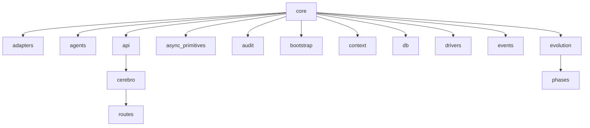

# NEXUS Global Architecture

**Generated**: 2025-12-16 19:13

---

## System Overview

---

## Module Hierarchy

---

## Core Modules

| Module | Purpose | Key Classes |
|--------|---------|-------------|

---

## Statistics

| Metric | Value |
|--------|-------|
| Total Python Files | 410 |
| Total Lines of Code | 137,987 |
| Total Classes | 1,223 |
| Total Functions | 573 |
| Core Modules | 0 |
| Test Files | 104 |

---
*Auto-generated by nexus-doc-generator*