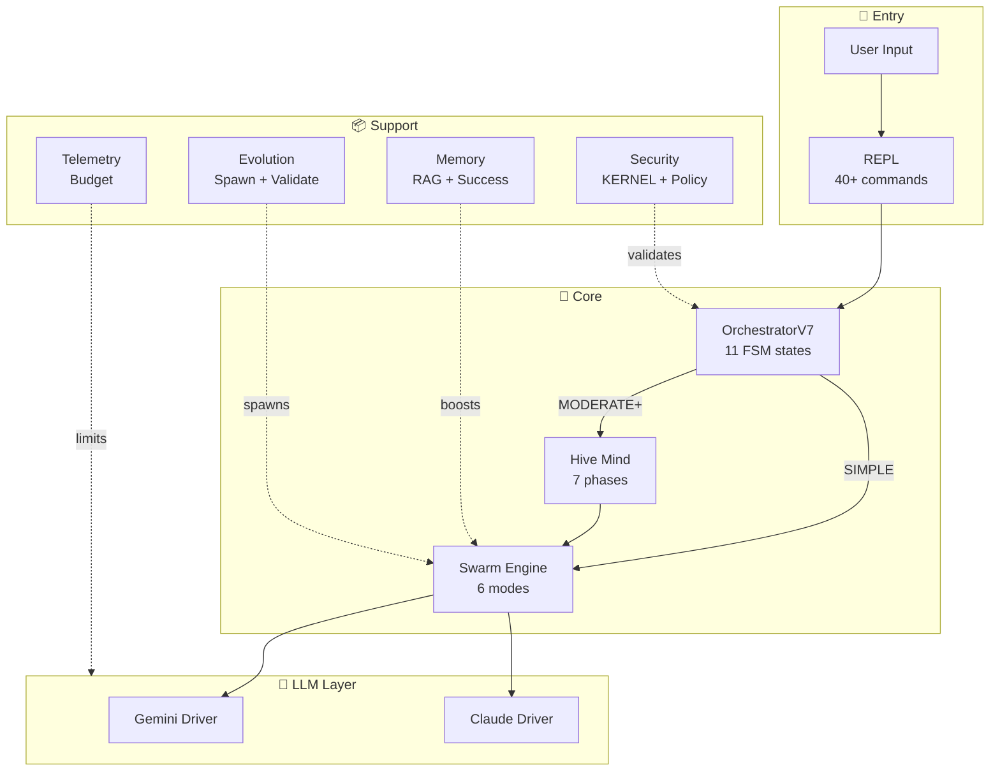
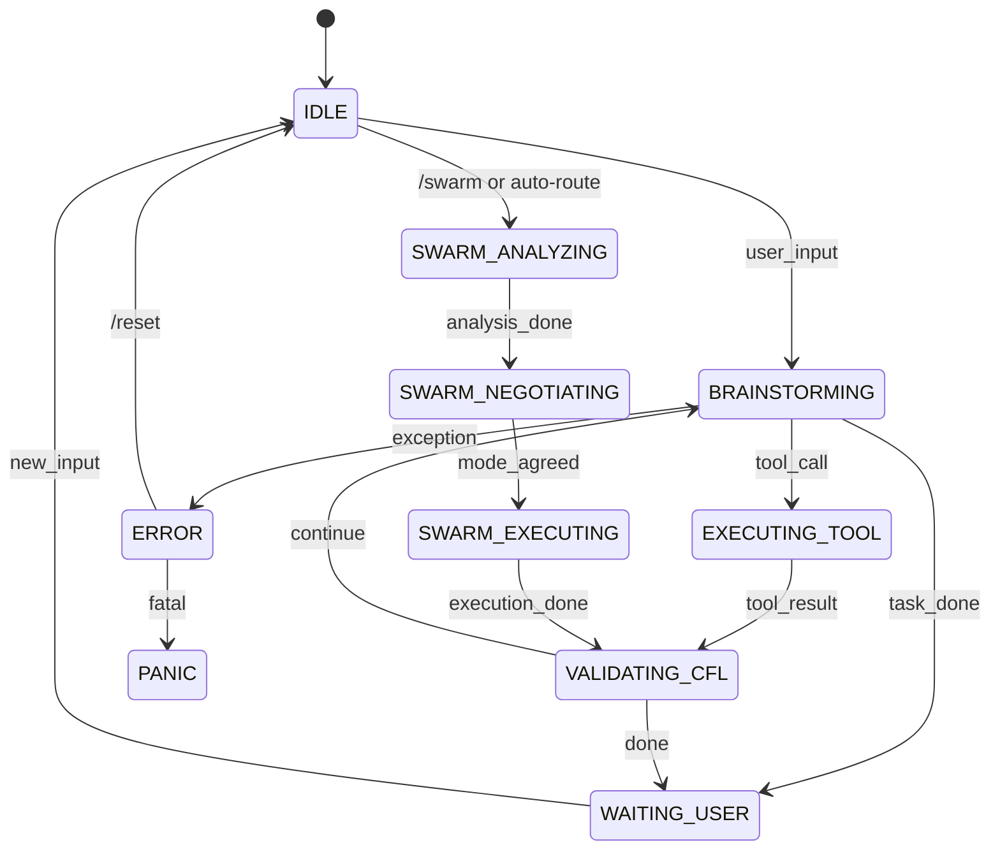
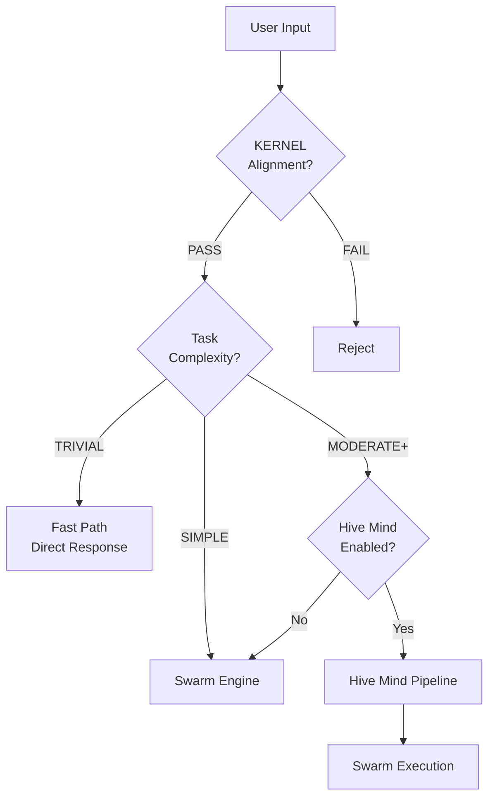
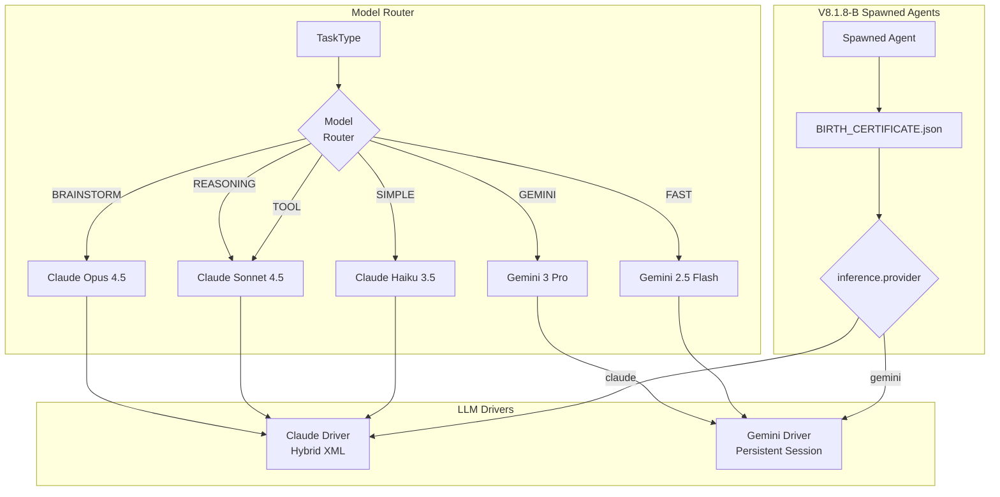
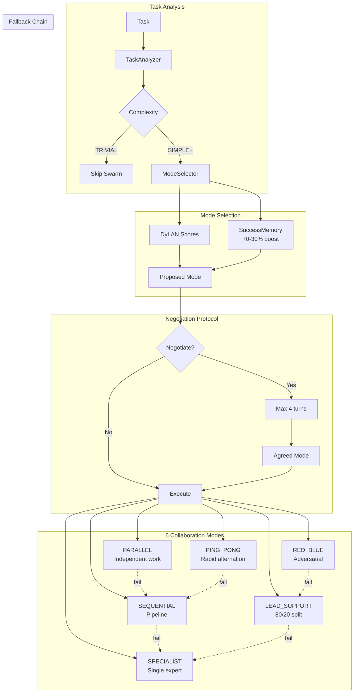
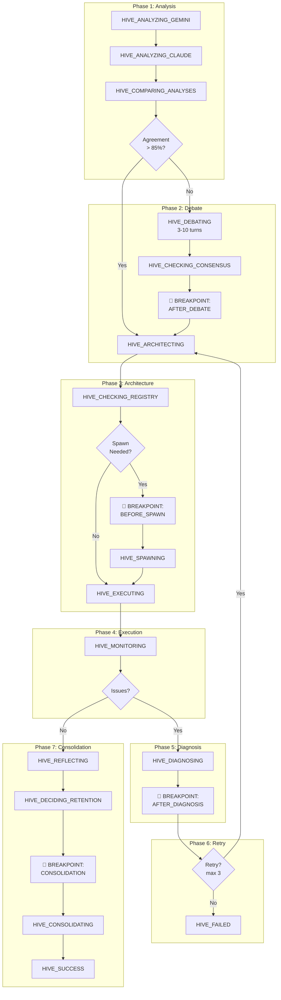

# MISSION: Map NEXUS V8.1 Architecture (Hierarchical Approach)

## Context
NEXUS V8.1 "True Hive Mind" - Multi-agent orchestrator with 42k LOC across 126 files.
Generate a **hierarchical** architecture map: one high-level overview + detailed zooms per subsystem.

---

## Output Structure (Single .md File)

Your deliverable is ONE markdown file with this structure:

```markdown
# NEXUS V8.1 Architecture Map

## 1. HIGH-LEVEL OVERVIEW (Bird's Eye)
[Mermaid: 15-20 nodes, major subsystems only]

## 2. ZOOM: Orchestration Core
[Mermaid: FSM states, handlers, transitions]

## 3. ZOOM: LLM Drivers & Routing
[Mermaid: Provider selection, model routing]

## 4. ZOOM: Swarm Engine
[Mermaid: 6 modes, negotiation, execution]

## 5. ZOOM: Hive Mind Pipeline
[Mermaid: 7 phases, states, breakpoints]

## 6. ZOOM: Evolution & Spawning
[Mermaid: spawn flow, validation tiers]

## 7. ZOOM: Memory Systems
[Mermaid: RAG, SuccessMemory, flows]

## 8. FUNCTIONAL INVENTORY
[Tables: commands, states, dataclasses]

## 9. STATISTICS
[Summary metrics]
```

---

## 1. HIGH-LEVEL OVERVIEW

### 1.1 Scope
Show ONLY the 10 major subsystems and their primary connections:

```
User → REPL → Orchestrator → [Swarm | HiveMind] → Drivers → [Gemini | Claude]
                ↓                    ↓
            Security              Memory
                ↓                    ↓
            Evolution            Telemetry
```

### 1.2 Mermaid Template


### 1.3 Files to Scan
```
nexus7.py                           # Entry point
core/orchestration_v7.py            # Central hub
core/interface/repl.py              # Commands
```

---

## 2. ZOOM: Orchestration Core

### 2.1 Scope
- 11 FSM states and transitions
- FSMHandlers dispatch
- AgentInvoker routing (V8.1.8-B)

### 2.2 Mermaid Template


### 2.3 Key Decision Points


### 2.4 Files to Scan
```
core/fsm/states.py                  # OrchestratorState enum
core/orchestration/fsm_handlers.py  # State handlers
core/orchestration/agent_invoker.py # Provider routing
core/orchestration/context_builder.py
core/fsm/stagnation_detector.py     # Hot-Swap Lead
```

---

## 3. ZOOM: LLM Drivers & Routing

### 3.1 Scope
- Model selection (Opus/Sonnet/Flash/Pro)
- Provider routing (V8.1.8-B InferenceConfig)
- Session isolation (V8.1.6 UUID)

### 3.2 Mermaid Template


### 3.3 Files to Scan
```
core/routing/model_router.py        # TaskType → Model
core/drivers/gemini_driver_v7.py    # Gemini CLI wrapper
core/drivers/claude_driver_hybrid.py # Claude API
core/drivers/async_adapter.py       # Async bridge
core/bootstrap/agent_loader.py      # InferenceConfig
```

---

## 4. ZOOM: Swarm Engine

### 4.1 Scope
- 6 collaboration modes
- DyLAN-based selection
- Negotiation protocol
- Fallback chain

### 4.2 Mermaid Template


### 4.3 Files to Scan
```
core/swarm/hybrid_swarm_engine.py   # Main orchestrator
core/swarm/mode_selector.py         # DyLAN + memory boost
core/swarm/mode_executors.py        # 6 mode implementations
core/swarm/collaboration_modes.py   # Mode definitions
core/swarm/negotiation_protocol.py  # Negotiation logic
core/swarm/task_analyzer.py         # Complexity detection
core/swarm/agent_metrics.py         # AgentProfile, DyLAN
core/swarm/session_manager.py       # Session isolation
```

---

## 5. ZOOM: Hive Mind Pipeline

### 5.1 Scope
- 7-phase pipeline
- 28 HiveMind states
- User breakpoints
- Retry logic

### 5.2 Mermaid Template


### 5.3 Files to Scan
```
core/hive_mind/orchestrator.py      # TrueHiveMind
core/hive_mind/types.py             # 25+ dataclasses, HiveMindState
core/hive_mind/phases/phase_analysis.py
core/hive_mind/phases/phase_debate.py
core/hive_mind/phases/phase_architecture.py
core/hive_mind/phases/phase_execution.py
core/hive_mind/phases/phase_diagnosis.py
core/hive_mind/phases/phase_retry.py
core/hive_mind/phases/phase_consolidation.py
core/hive_mind/user_interaction.py  # Breakpoints
core/hive_mind/adaptive_debate.py   # Turn calculation
```

---

## 6. ZOOM: Evolution & Spawning

### 6.1 Scope
- /spawn flow (V8.1.8 dynamic)
- Brainstorm → Create → Validate → Promote
- 5-tier validation
- InferenceConfig (V8.1.8-B)

### 6.2 Mermaid Template
```mermaid
graph TD
    subgraph Spawn[/spawn Flow - V8.1.8]
        CMD[/spawn SQL Expert] --> BUDGET{Budget<br/>OK?}
        BUDGET -->|No| REJECT[Reject]
        BUDGET -->|Yes| UUID[Generate UUID]
        UUID --> DOMAIN[Detect Domains]
        DOMAIN --> BRAIN[BrainstormPhase<br/>Gemini + Claude]
        BRAIN --> PROMPT[Generated Prompt]
        PROMPT --> MODEL[V8.1.8-B:<br/>Select Model]
        MODEL --> CERT[BIRTH_CERTIFICATE.json]
        CERT --> POOL[Register AgentPool]
    end

    subgraph Validation[5-Tier Validation]
        CHILD[Child NEXUS] --> T1[Tier 1: Syntax]
        T1 --> T2[Tier 2: Smoke Test]
        T2 --> T3[Tier 3: Benchmark]
        T3 --> T4[Tier 4: Red Team]
        T4 --> T5[Tier 5: Live Eval]
        T5 --> PROMOTE{Auto-Promote?}
    end

    subgraph Promotion[Promotion Criteria]
        PROMOTE -->|+3% perf| AUTO[Auto-Promote]
        PROMOTE -->|Manual| REVIEW[Human Review]
        AUTO --> LINEAGE[Update LINEAGE.json]
        REVIEW --> LINEAGE
    end
```

### 6.3 Files to Scan
```
core/interface/repl.py              # spawn_agent(), _brainstorm_agent_prompt()
core/evolution/manager.py           # EvolutionManager
core/evolution/phases/brainstorm.py # BrainstormPhase
core/evolution/phases/create.py     # CreatePhase
core/evolution/phases/promote.py    # PromotePhase
core/evolution/validator.py         # ChildValidator
core/evolution/tiered_validator.py  # 5-tier validation
core/evolution/lineage.py           # Lineage tracking
core/bootstrap/agent_loader.py      # SpawnedAgentLoader, InferenceConfig
```

---

## 7. ZOOM: Memory Systems

### 7.1 Scope
- ProjectMemory (RAG)
- SuccessMemory (patterns)
- AutoMemory (task-type)
- Memory boost in ModeSelector

### 7.2 Mermaid Template
```mermaid
graph TD
    subgraph RAG[Project Memory - RAG]
        LEARN[/learn path] --> INDEX[Index Files]
        INDEX --> BACKEND{Backend}
        BACKEND --> DENSE[Dense<br/>LanceDB + MiniLM]
        BACKEND --> TFIDF[TF-IDF<br/>Fallback]
        BACKEND --> BM25[BM25<br/>Fallback]
        QUERY[/rag query] --> SEARCH[Semantic Search]
        SEARCH --> CHUNKS[Top-K Chunks]
    end

    subgraph Success[Success Memory]
        TASK_DONE[Task Complete] --> RECORD[record_success()]
        RECORD --> ENTRY[SuccessEntry<br/>mode, agents, duration]
        ENTRY --> STORE[(successes.json)]

        NEW_TASK[New Task] --> SIMILAR[search_similar()]
        SIMILAR --> STORE
        SIMILAR --> BOOST[Mode Boost<br/>0-30%]
    end

    subgraph Auto[Auto Memory]
        SUCCESS[Success] --> AUTO_REC[record_success()]
        FAILURE[Failure] --> AUTO_FAIL[record_failure()]
        AUTO_REC --> JSONL[(successes.jsonl)]
        AUTO_FAIL --> JSONL_F[(failures.jsonl)]

        SUGGEST[suggest_mode()] --> JSONL
        SUGGEST --> BEST[Best Mode for Type]
    end

    subgraph Integration[Memory Integration]
        BOOST --> SELECTOR[ModeSelector]
        BEST --> SELECTOR
        CHUNKS --> CONTEXT[Context Builder]
    end
```

### 7.3 Files to Scan
```
core/memory/project_memory.py       # RAG orchestrator
core/memory/success_memory.py       # Successful patterns
core/memory/auto_memory.py          # Task-type patterns
core/memory/types.py                # Chunk, IndexStats
core/memory/backends/dense.py       # LanceDB
core/memory/backends/tfidf.py       # TF-IDF
core/memory/backends/bm25.py        # BM25
core/swarm/mode_selector.py         # Memory boost integration
```

---

## 8. FUNCTIONAL INVENTORY

### 8.1 All Slash Commands (40+)

#### 🐝 Collaboration
| Command | Description |
|---------|-------------|
| `/swarm <task>` | Route through Hybrid Swarm Engine |
| `/swarm-status` | Show current mode + DyLAN metrics |
| `/swarm-fsm <task>` | Debug: route via FSM states |
| `/pool-stats` | Show agent pool scores |

#### 🧬 Evolution
| Command | Description |
|---------|-------------|
| `/spawn <role>` | Create specialized agent |
| `/agents` | List all spawned agents |
| `/evolve [count]` | Create child generations |
| `/evolve-status` | Show evolution stats |
| `/review` | Review pending children |
| `/specialize <mission>` | Create NEXUS spinoff |

#### 📊 Monitoring
| Command | Description |
|---------|-------------|
| `/status` | Orchestrator state |
| `/telemetry` | 7-day report |
| `/telemetry export` | Export to CSV |
| `/budget` | Budget status |
| `/budget reset` | Reset daily counter |
| `/budget add <amt>` | Emergency credit |
| `/budget history` | Recent costs |

#### 📁 Workspace
| Command | Description |
|---------|-------------|
| `/workspace` | Current workspace info |
| `/workspace new` | Create new workspace |
| `/workspace list` | List all workspaces |
| `/workspace switch` | Switch workspace |
| `/bootstrap [path]` | Generate NEXUS.md |

#### 🧠 Memory
| Command | Description |
|---------|-------------|
| `/learn [path]` | Index into RAG |
| `/forget [path]` | Remove from RAG |
| `/memory-status` | Index statistics |
| `/rag init` | Index workspace/memory/ |
| `/rag clear` | Clear RAG data |
| `/rag query <text>` | Test retrieval |

#### ⚙️ System
| Command | Description |
|---------|-------------|
| `/clear` | Clear terminal |
| `/reset` | Reset to IDLE |
| `/doctor` | Run diagnostics |
| `/mode <name>` | Change mode |
| `/chat` | Chat-only (no tools) |
| `/help` | Help message |
| `/tutorial` | Interactive guide |
| `/quickstart` | Quick start |
| `exit` | Exit NEXUS |

### 8.2 FSM States (39 Total)

#### Orchestrator States (11)
| State | Description |
|-------|-------------|
| `IDLE` | Waiting for input |
| `BRAINSTORMING` | Agents exchanging |
| `EXECUTING_TOOL` | Tool execution |
| `VALIDATING_CFL` | Cognitive feedback |
| `WAITING_USER` | Task complete |
| `ERROR` | Recoverable error |
| `PANIC` | Fatal error |
| `EVOLUTION_BRAINSTORM` | Mutation design |
| `SWARM_ANALYZING` | Task analysis |
| `SWARM_NEGOTIATING` | Mode negotiation |
| `SWARM_EXECUTING` | Mode execution |

#### HiveMind States (28)
| Phase | States |
|-------|--------|
| Phase 1 | `HIVE_ANALYZING_GEMINI`, `HIVE_ANALYZING_CLAUDE`, `HIVE_COMPARING_ANALYSES` |
| Phase 2 | `HIVE_DEBATING`, `HIVE_CHECKING_CONSENSUS`, `HIVE_BREAKPOINT_DEBATE` |
| Phase 3 | `HIVE_ARCHITECTING`, `HIVE_CHECKING_REGISTRY`, `HIVE_BREAKPOINT_SPAWN`, `HIVE_SPAWNING` |
| Phase 4 | `HIVE_EXECUTING`, `HIVE_MONITORING` |
| Phase 5 | `HIVE_DIAGNOSING`, `HIVE_BREAKPOINT_DIAGNOSIS` |
| Phase 6 | `HIVE_DECIDING_RETRY` |
| Phase 7 | `HIVE_REFLECTING`, `HIVE_DECIDING_RETENTION`, `HIVE_CONSOLIDATING` |
| Terminal | `HIVE_SUCCESS`, `HIVE_FAILED`, `HIVE_ESCALATE` |
| Gating | `HIVE_GATING` |

### 8.3 Collaboration Modes (6)
| Mode | Description | Fallback |
|------|-------------|----------|
| `PARALLEL` | Independent work, merge | SEQUENTIAL |
| `SEQUENTIAL` | Pipeline (A → B) | SPECIALIST |
| `LEAD_SUPPORT` | 80/20 split | SPECIALIST |
| `PING_PONG` | Rapid alternation | SEQUENTIAL |
| `SPECIALIST` | Single expert | None |
| `RED_BLUE` | Adversarial | LEAD_SUPPORT |

### 8.4 Key Dataclasses
| Dataclass | Key Fields | File |
|-----------|-----------|------|
| `TaskAnalysis` | complexity, domains, reasoning | task_analyzer.py |
| `ModeProposal` | mode, reasoning, confidence | mode_selector.py |
| `AgentProfile` | agent_id, provider, capabilities, dylan_score, uuid | agent_metrics.py |
| `InferenceConfig` | provider, model, reasoning | agent_loader.py |
| `SuccessEntry` | task_hash, swarm_mode, agents_used, quality_score | success_memory.py |
| `HiveMindResult` | success, final_output, agents_used, agents_spawned | types.py |
| `DebateResult` | status, final_approach, debate_history, satisfaction | phase_debate.py |
| `ExecutionPlan` | steps, dependencies, estimated_duration | phase_architecture.py |
| `FailureDiagnosis` | failure_type, root_cause, recommended_changes | phase_diagnosis.py |

---

## 9. STATISTICS

### Codebase Metrics
| Metric | Value |
|--------|-------|
| Total Directories | 24 |
| Total Python Files | 126 |
| Total Lines of Code | 42,831 |
| Classes | 91 |
| Dataclasses | 50+ |
| Enums | 15+ |

### Component Metrics
| Component | Files | LOC |
|-----------|-------|-----|
| Orchestration | 6 | ~2,500 |
| Swarm Engine | 9 | ~5,800 |
| Hive Mind | 12 | ~5,500 |
| Memory | 7 | ~2,500 |
| Evolution | 9 | ~4,000 |
| Drivers | 4 | ~1,700 |
| Interface | 3 | ~3,000 |
| Security | 6 | ~1,700 |

### Test Coverage
| Metric | Value |
|--------|-------|
| Total Tests | 1,094 |
| Passing | 1,078 |
| Flaky (LLM) | 16 |

---

## Execution Strategy

### Quick Scan (15 min)
```bash
# Core entry points only
read nexus7.py
read core/orchestration_v7.py
read core/interface/commands.py
grep "class.*:" core/fsm/states.py
grep "class.*:" core/hive_mind/types.py
```

### Full Scan (45 min)
Execute sections 2-7 file lists sequentially.

### Validation
- Cross-reference against `CODEBASE_SNAPSHOT.md`
- Verify states exist in `states.py` and `types.py`
- Verify commands exist in `commands.py`

---

## Anti-Hallucination Checklist

Before submitting, verify:
- [ ] All classes/functions exist in listed files
- [ ] All states are in OrchestratorState or HiveMindState enums
- [ ] All commands are in COMMAND_CATEGORIES
- [ ] No invented field names (check docs/DATACLASS_FIELDS.md)
- [ ] Mermaid syntax renders correctly

---

## Source
- **Version**: NEXUS V8.1.8-B
- **Date**: 2025-12-09
- **Author**: Claude (enriched from user prompt)
- **Reference**: CODEBASE_SNAPSHOT.md, exploration agent results
