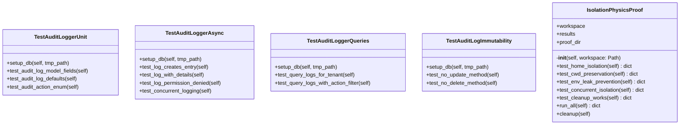

# audit

_No package description available._

## Overview

| Metric | Value |
|--------|-------|
| **Path** | `C:\Code\NEXUS\NEXUS-N7A\tests\audit` |
| **Modules** | 3 |
| **Total Lines** | 683 |
| **Classes** | 5 |
| **Functions** | 0 |

## Architecture

## Modules

| Module | Description | Classes | Functions |
|--------|-------------|---------|-----------|
| [test_audit_logger](test_audit_logger.py) | V12.2 IRONCLAD - Audit Logger Tests | 4 | 0 |
| [test_isolation_physics](test_isolation_physics.py) | ISOLATION PHYSICS PROOF - OBSIDIAN V2.0 Audit | 1 | 0 |

---
*Auto-generated by nexus-doc-generator 1.0.0 - 2025-12-16 19:13*