# fsm

_No package description available._

## Overview

| Metric | Value |
|--------|-------|
| **Path** | `C:\Code\NEXUS\NEXUS-N7A\tests\fsm` |
| **Modules** | 3 |
| **Total Lines** | 830 |
| **Classes** | 13 |
| **Functions** | 2 |

## Architecture

```mermaid
classDiagram
    class TestHibernateState {
        +test_hibernate_state_exists(self)
        +test_hibernate_in_transition_matrix(self)
        +test_hibernate_exit_transitions(self)
        +test_active_states_can_enter_hibernate(self)
    }
    class TestHibernationManager {
        +setup_db(self, tmp_path)
        +test_enter_hibernate(self)
        +test_get_hibernation(self)
        +test_exit_hibernate(self)
        +test_no_hibernation_returns_none(self)
        +test_exit_nonexistent_returns_none(self)
        +test_new_hibernate_replaces_old(self)
    }
    class TestHibernationStateModel {
        +setup_db(self, tmp_path)
        +test_model_fields(self)
        +test_is_expired(self)
        +test_not_expired(self)
    }
    class TestHibernationWorkspaceIsolation {
        +setup_db(self, tmp_path)
        +test_different_workspaces_independent(self)
        +test_different_tenants_independent(self)
    }
    class TestLeadingIndicators {
        +test_indicator_detection_english(self, predictor)
        +test_indicator_detection_french(self, predictor)
        +test_no_indicators_returns_low_score(self, predictor)
        +test_mixed_language_indicators(self, predictor)
    }
    class TestTrajectoryAnalysis {
        +test_trajectory_decreasing_length(self, predictor)
        +test_trajectory_stable_length(self, predictor)
        +test_trajectory_increasing_length(self, predictor)
    }
    class TestToolFactor {
        +test_tool_mention_without_use(self, predictor)
        +test_tool_mention_with_use(self, predictor)
        +test_no_tool_mention(self, predictor)
    }
    class TestSimilarityFactor {
        +test_similarity_increase_detection(self, predictor)
        +test_different_messages_low_similarity(self, predictor)
    }
    class TestPredictionLevels {
        +test_prediction_continue(self, predictor)
        +test_prediction_monitor(self, predictor)
        +test_prediction_nudge(self, predictor)
        +test_prediction_intervene(self, predictor)
    }
    class TestPredictionResult {
        +test_prediction_has_all_fields(self, predictor)
        +test_probability_in_range(self, predictor)
        +test_factors_dict_structure(self, predictor)
    }
    class TestEdgeCases {
        +test_single_message(self, predictor)
        +test_empty_predictor(self, predictor)
        +test_very_long_message(self, predictor)
        +test_unicode_messages(self, predictor)
        +test_empty_message(self, predictor)
    }
    class TestAccuracy {
        +test_precision_on_stagnant_samples(self, predictor, stagnation_samples)
        +test_precision_on_normal_samples(self, predictor, stagnation_samples)
        +test_overall_accuracy(self, predictor, stagnation_samples)
    }
    class TestStatistics {
        +test_get_stats(self, predictor)
        +test_reset(self, predictor)
    }
```

## Modules

| Module | Description | Classes | Functions |
|--------|-------------|---------|-----------|
| [test_hibernate](test_hibernate.py) | V12.2 IRONCLAD - HIBERNATE State Tests | 4 | 0 |
| [test_stagnation_predictor](test_stagnation_predictor.py) | V12.4 COGNITIVE BOOST - StagnationPredictor Tests | 9 | 2 |

---
*Auto-generated by nexus-doc-generator 1.0.0 - 2025-12-16 19:13*