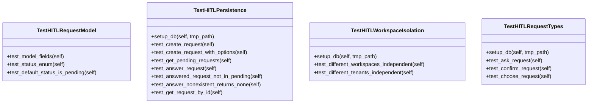

# interaction

Interaction tests for NEXUS.

## Overview

| Metric | Value |
|--------|-------|
| **Path** | `C:\Code\NEXUS\NEXUS-N7A\tests\interaction` |
| **Modules** | 2 |
| **Total Lines** | 359 |
| **Classes** | 4 |
| **Functions** | 0 |

## Architecture

## Modules

| Module | Description | Classes | Functions |
|--------|-------------|---------|-----------|
| [test_hitl_persistence](test_hitl_persistence.py) | V12.2 IRONCLAD - HITL Persistence Tests | 4 | 0 |

---
*Auto-generated by nexus-doc-generator 1.0.0 - 2025-12-16 19:13*