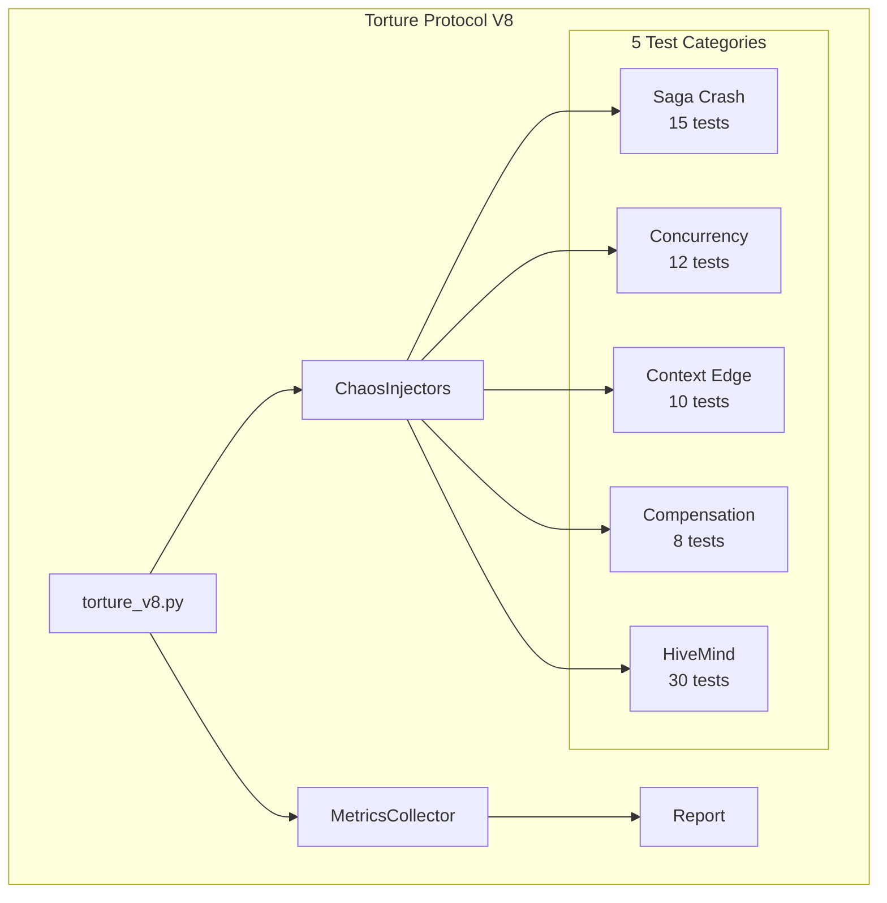

# Module : Torture Protocol V8

## Role dans l'Architecture NEXUS V9.0

Le module Torture Protocol V8 (V8.2.0d) fournit une suite de tests de stress complète pour valider la robustesse de l'intégration SagaManager + HiveMind. Il simule des conditions adverses (crashes, race conditions, corruptions) pour s'assurer que le système récupère correctement.

## Composants Clés

### Core Classes

* `base.py`:
  - `TortureBase`: Classe de base pour tous les tests torture
  - `TortureResultV8`: Dataclass pour les résultats de test

* `metrics_collector.py`:
  - `MetricsCollector`: Collecte et calcule les métriques de torture
  - `ScenarioMetrics`: Dataclass pour les métriques par scénario

* `chaos_injectors.py`:
  - `CrashInjector`: Simule des crashes à des points spécifiques
  - `RaceInjector`: Introduit des race conditions via des délais
  - `CorruptionInjector`: Corrompt des fichiers saga de diverses manières
  - `TimeoutInjector`: Injecte des timeouts dans les opérations

### Scenarios (5 catégories, 75+ tests)

| Fichier | Tests | Description |
|---------|-------|-------------|
| `saga_crash.py` | 15 (CR-001 to CR-015) | Crash recovery - Partial writes, corrupted JSON, fsync crashes |
| `saga_concurrency.py` | 12 (CC-001 to CC-012) | Race conditions - Parallel checkpoints, high contention |
| `context_edge.py` | 10 (CE-001 to CE-010) | Edge cases - Truncation, missing estimates, deque/list |
| `compensation.py` | 8 (CF-001 to CF-008) | Compensation failures - Exceptions, partial chains, timeouts |
| `hive_integration.py` | 30 (HM-001 to HM-030) | HiveMind pipeline - Full pipeline, phase failures, hot-swap |

## Architecture & Flux

### Entrées
- Configuration pytest (markers, fixtures)
- SagaManager instance (via fixtures)
- Mock drivers pour LLM

### Sorties
- `TortureResultV8` avec success/failure
- `MetricsCollector` avec rates calculés
- Rapport JSONL dans `workspace/torture_v8/`

### Configuration
- `SKIP_LLM_TESTS`: Skip tests nécessitant API réelles
- pytest markers: `@torture`, `@torture_saga`, `@torture_hive`, `@torture_slow`

## Dépendances

### Utilise
- `core/hive_mind/saga_manager.py`: SagaManager pour checkpoints
- `core/hive_mind/types.py`: HiveMindState, dataclasses
- `pytest-asyncio`: Tests async
- `unittest.mock`: Mocking

### Utilisé par
- `.github/workflows/ci.yml`: Nightly torture tests
- Développeurs pour validation pre-release

## Diagramme



## Métriques Cibles

| Metric | Target |
|--------|--------|
| Success Rate | >95% |
| Recovery Rate | >90% |
| Panic Rate | <1% |
| Hot-Swap Effectiveness | >80% |

## Tests Associés

```bash
# Run all torture tests
pytest tests/torture_v8.py -m torture -v --tb=short

# Run by category
pytest tests/torture_v8.py -m torture_saga -v   # Saga tests
pytest tests/torture_v8.py -m torture_hive -v   # HiveMind tests
pytest tests/torture_v8.py -m torture_slow -v   # Slow tests (>5s)

# Standalone check
python tests/torture_v8.py
```

## Version History

| Version | Date | Changes |
|---------|------|---------|
| V8.2.0d | 2025-12-11 | Initial implementation - 75 tests across 5 categories |
