# torture

NEXUS V8.2.0d Torture Protocol Module

Comprehensive stress testing for SagaManager + HiveMind integration.

Usage:
    pytest tests/torture_v8.py -m torture -v
    python tests/torture_v8.py

## Overview

| Metric | Value |
|--------|-------|
| **Path** | `C:\Code\NEXUS\NEXUS-N7A\tests\torture` |
| **Modules** | 4 |
| **Total Lines** | 949 |
| **Classes** | 8 |
| **Functions** | 3 |

## Architecture

```mermaid
classDiagram
    class TortureResultV8 {
        +str scenario
        +str test_id
        +bool success
        +float duration_ms
        +bool recovery_attempted
        +bool recovery_succeeded
        +bool panic_occurred
        +Optional[str] error
        +Dict[str, Any] metrics
        +str timestamp
    }
    class TortureBase {
        +workspace
        +metrics
        +lock
        +log_file
        -__init__(self, workspace_name: str=...)
        +sagas_dir(self) Path
        +log_result(self, result: TortureResultV8)
        +run_test(self, scenario: str, test_id: str, test_func, expect_recovery: bool=...) TortureResultV8
        +generate_report(self)
        +assert_targets(self, success_target: float=..., recovery_target: float=..., panic_target: float=..., hot_swap_target: float=...)
        +cleanup(self)
    }
    class CrashInjector {
        +crash_count
        +crash_at
        -__init__(self)
        +crash_after_n_checkpoints(self, n: int)
        +crash_during_persist(self)
        +crash_during_fsync(self)
        +crash_during_rename(self)
        +crash_at_phase(self, phase: str)
    }
    class RaceInjector {
        +delays
        -__init__(self)
        +delay_persist(self, delay_ms: int)
        +delay_operation(self, delay_ms: int)
        +concurrent_checkpoints(self, saga, phases: list, delay_between_ms: int=...)
        +concurrent_operations(self, operations: list, stagger_ms: int=...)
    }
    class CorruptionInjector {
        +CORRUPTION_TYPES
        +corrupt_json(self, filepath: Path, corruption_type: str=...)
        +truncate_file(self, filepath: Path, bytes_to_keep: int=...)
        +create_empty_file(self, filepath: Path)
        +create_locked_file(self, filepath: Path)
        +create_saga_with_unknown_phase(self, saga_dir: Path, task_id: str)
        +create_saga_with_future_timestamp(self, saga_dir: Path, task_id: str)
        +create_incomplete_saga(self, saga_dir: Path, task_id: str)
    }
    class TimeoutInjector {
        +timeout(self, timeout_ms: int)
        +async_timeout(self, coro, timeout_ms: int)
    }
    class ScenarioMetrics {
        +str name
        +bool success
        +float duration_ms
        +bool recovery_attempted
        +bool recovery_succeeded
        +bool panic_occurred
        +Optional[str] error_message
        +str timestamp
        +to_dict(self) Dict[str, Any]
    }
    class MetricsCollector {
        +List[ScenarioMetrics] scenarios
        +datetime start_time
        +record_test(self, name: str, success: bool, duration_ms: float, recovery_attempted: bool=..., recovery_succeeded: bool=..., panic_occurred: bool=..., error: Optional[str]=...)
        +calculate_rates(self) Dict[str, Any]
        -_calculate_hot_swap_rate(self) float
        +get_failures(self) List[ScenarioMetrics]
        +get_panics(self) List[ScenarioMetrics]
        +get_slowest(self, n: int=...) List[ScenarioMetrics]
        +to_jsonl(self, filepath: Path)
        +to_dict(self) Dict[str, Any]
        +summary(self) str
        +assert_targets(self, success_target: float=..., recovery_target: float=..., panic_target: float=..., hot_swap_target: float=...)
    }
```

## Modules

| Module | Description | Classes | Functions |
|--------|-------------|---------|-----------|
| [base](base.py) | Torture Protocol V8 - Base Classes and Fixtures | 2 | 3 |
| [chaos_injectors](chaos_injectors.py) | Torture Protocol V8 - Chaos Injectors | 4 | 0 |
| [metrics_collector](metrics_collector.py) | Torture Protocol V8 - Metrics Collector | 2 | 0 |

## Subpackages

| Package | Description | Modules |
|---------|-------------|---------|
| [scenarios/](C:\Code\NEXUS\NEXUS-N7A\tests\torture\scenarios/README.md) |  | 0 |

## Aggregated Statistics

Statistics from all subpackages:

| Metric | Value |
|--------|-------|
| Subpackages | 1 |
| Total Modules | 0 |
| Total Lines of Code | 0 |
| Total Classes | 0 |
| Total Functions | 0 |

---
*Auto-generated by nexus-doc-generator 1.0.0 - 2025-12-16 19:13*