# scenarios

Torture Protocol V8 Scenarios

Categories:
- saga_crash: Crash recovery tests (15)
- saga_concurrency: Concurrency tests (12)
- context_edge: Context edge cases (10)
- compensation: Compensation failure tests (8)
- hive_integration: HiveMind integration tests (30)

## Overview

| Metric | Value |
|--------|-------|
| **Path** | `C:\Code\NEXUS\NEXUS-N7A\tests\torture\scenarios` |
| **Modules** | 6 |
| **Total Lines** | 3398 |
| **Classes** | 14 |
| **Functions** | 95 |

## Architecture

```mermaid
classDiagram
    class MockContextItem {
        +str content
        +int token_estimate
    }
    class MockDequeContextManager {
        -_items
        -_current_tokens
        -__init__(self, items=...)
    }
    class MockListContextManager {
        +messages
        -__init__(self, messages=...)
    }
    class MockBothContextManager {
        -_items
        -_current_tokens
        +messages
        -__init__(self, items=..., messages=...)
    }
    class MockNoTokenContextManager {
        -_items
        -_current_tokens
        -__init__(self, items=...)
    }
    class NoTokenItem {
        +content
        -__init__(self, content)
    }
    class InvalidContextManager {
    }
    class CustomObject {
        +value
        -__init__(self, value)
    }
    class MockConfig {
        +int hive_mind_budget_limit
        +int hive_mind_breakpoint_timeout
    }
    class MockDriver {
        +name
        +call_count
        +last_prompt
        -_fail_at_call
        -_responses
        -__init__(self, name: str=...)
        +generate(self, prompt: str, **kwargs) str
        +set_fail_at(self, call_number: int)
        +add_response(self, response: str)
    }
    class MockHiveMindPhase {
        +name
        -_default_result
        -_fail
        -_delay_ms
        +execute_count
        -__init__(self, name: str, default_result: Any=...)
        +execute(self, *args, **kwargs) Any
        +set_fail(self, should_fail: bool=...)
        +set_delay(self, delay_ms: int)
    }
    class AnalysisResult {
        +comparison
        +needs_debate
        -__init__(self)
    }
    class DebatePhaseResult {
        +debate_result
        +final_approach
        +was_skipped
        -__init__(self)
    }
    class ExecutionResult {
        +success
        +output
        +step_results
        +total_duration
        +total_tokens
        +artifacts_created
        -__init__(self)
    }
```

## Modules

| Module | Description | Classes | Functions |
|--------|-------------|---------|-----------|
| [compensation](compensation.py) | Torture Protocol V8 - Compensation Failure Tests | 0 | 10 |
| [context_edge](context_edge.py) | Torture Protocol V8 - Context Edge Case Tests | 8 | 12 |
| [hive_integration](hive_integration.py) | Torture Protocol V8 - HiveMind Integration Tests | 6 | 38 |
| [saga_concurrency](saga_concurrency.py) | Torture Protocol V8 - Saga Concurrency Tests | 0 | 15 |
| [saga_crash](saga_crash.py) | Torture Protocol V8 - Saga Crash Recovery Tests | 0 | 20 |

---
*Auto-generated by nexus-doc-generator 1.0.0 - 2025-12-16 19:13*