# v10

V10 Tests - Multi-Tenant Architecture Tests.

NEXUS V10 PRISM

Tests for the multi-tenant architecture introduced in V10.

## Overview

| Metric | Value |
|--------|-------|
| **Path** | `C:\Code\NEXUS\NEXUS-N7A\tests\v10` |
| **Modules** | 5 |
| **Total Lines** | 1807 |
| **Classes** | 27 |
| **Functions** | 0 |

## Architecture

```mermaid
classDiagram
    class TestCerebroEventTypes {
        +test_event_type_values(self)
        +test_event_creation(self)
        +test_event_to_json(self)
        +test_event_from_json(self)
        +test_event_channel_name(self)
        +test_wildcard_channel(self)
    }
    class TestRedisEventBus {
        +reset_singleton(self)
        +test_singleton_pattern(self)
        +test_initial_state(self)
        +test_graceful_degradation_publish(self)
        +test_health_check_disconnected(self)
    }
    class TestRedisLogHandler {
        +test_handler_creation(self)
        +test_start_stop_lifecycle(self)
        +test_emit_non_blocking(self)
        +test_queue_overflow_drops(self)
        +test_get_stats(self)
    }
    class TestCerebroAPI {
        +client(self)
        +test_root_endpoint(self, client)
        +test_health_endpoint(self, client)
        +test_ping_endpoint(self, client)
        +test_ready_endpoint(self, client)
    }
    class TestHeadlessProviderIntegration {
        +reset_singleton(self)
        +test_ask_publishes_event(self)
        +test_confirm_publishes_event(self)
        +test_publish_events_disabled(self)
    }
    class TestMiddleware {
        +test_create_jwt_token(self)
        +test_decode_invalid_jwt(self)
    }
    class TestDependencies {
        +test_create_ws_url(self)
        +test_create_ws_url_with_token(self)
    }
    class TestEmbeddingEngineSingleton {
        +test_singleton_same_object(self)
        +test_singleton_via_class(self)
        +test_properties_before_load(self)
    }
    class TestEmbeddingEngineEncoding {
        +engine(self)
        +test_encode_single_text(self, engine)
        +test_encode_batch(self, engine)
        +test_encode_single_convenience(self, engine)
        +test_encode_empty_list(self, engine)
        +test_get_info(self, engine)
    }
    class TestIsolatedStorage {
        +test_dense_backend_accepts_engine(self)
        +test_different_storage_paths(self)
    }
    class TestMemorySingletonMigration {
        +test_auto_memory_has_prism_pattern(self)
        +test_success_memory_has_prism_pattern(self)
        +test_spotlighter_has_prism_pattern(self)
    }
    class TestServiceFactoryMemoryMethods {
        +test_get_embedding_engine_exists(self)
        +test_get_project_memory_exists(self)
        +test_get_auto_memory_exists(self)
        +test_get_success_memory_exists(self)
        +test_get_spotlighter_exists(self)
        +test_embedding_engine_is_global(self)
    }
    class TestONNXFallback {
        +test_backend_detection(self)
        +test_onnx_availability_check(self)
    }
    class TestDenseBackendIntegration {
        +backend(self)
        +test_get_info_includes_engine(self, backend)
        +test_dependencies_string_updated(self, backend)
    }
    class TestSessionContext {
        +test_context_creation(self)
        +test_context_immutable(self)
        +test_context_requires_tenant_id(self)
        +test_use_context_sets_and_resets(self)
        +test_nested_contexts(self)
        +test_get_current_session_raises_without_context(self)
    }
```

## Modules

| Module | Description | Classes | Functions |
|--------|-------------|---------|-----------|
| [test_cerebro](test_cerebro.py) | V10 CEREBRO Tests - Redis Event Bus & API Skeleton. | 7 | 0 |
| [test_memory_optimization](test_memory_optimization.py) | V10 MEMORY FORGE Tests - Shared Embedding Engine + Isolated Storage. | 7 | 0 |
| [test_prism_isolation](test_prism_isolation.py) | PRISM Isolation Tests - Multi-Tenant Data Isolation Verification. | 8 | 0 |
| [test_synapse_telemetry](test_synapse_telemetry.py) | V10 SYNAPSE Telemetry Tests - TelemetryBridge & Instrumentation. | 5 | 0 |

---
*Auto-generated by nexus-doc-generator 1.0.0 - 2025-12-16 19:13*