# v11

V11 SYNCHROTRON Tests.

## Overview

| Metric | Value |
|--------|-------|
| **Path** | `C:\Code\NEXUS\NEXUS-N7A\tests\v11` |
| **Modules** | 7 |
| **Total Lines** | 2090 |
| **Classes** | 32 |
| **Functions** | 0 |

## Architecture

```mermaid
classDiagram
    class TestConcurrencyLimiter {
        +setup_method(self)
        +test_singleton_pattern(self)
        +test_get_concurrency_limiter(self)
        +test_max_concurrent_from_constants(self)
        +test_sync_acquire_release(self)
        +test_async_acquire_release(self)
        +test_concurrency_limit_enforced(self)
        +test_sync_timeout(self)
        +test_async_timeout(self)
        +test_stats_tracking(self)
    }
    class TestEventLoopResponsiveness {
        +test_event_loop_not_blocked(self)
        +test_concurrent_tasks_fair(self)
    }
    class TestGracefulShutdown {
        +test_cancellation_cleanup(self)
    }
    class TestExecutorIntegration {
        +test_base_executor_import(self)
        +test_parallel_invocations_limited(self)
    }
    class TestDeadlockPrevention {
        +test_gemini_driver_has_stderr_drain(self)
        +test_claude_driver_has_stderr_drain(self)
        +test_gemini_driver_has_process_wait_timeout(self)
        +test_claude_driver_has_process_wait_timeout(self)
    }
    class TestHeadlessProviderInteractive {
        +test_default_non_interactive(self)
        +test_interactive_mode_enabled(self)
        +test_get_pending_requests_empty(self)
        +test_resolve_interaction_not_found(self)
    }
    class TestFileSizeLimit {
        +test_max_file_size_constant(self)
        +test_large_file_returns_413(self)
    }
    class TestStateSnapshot {
        +test_snapshot_includes_pending_interactions(self)
    }
    class TestInteractionEndpoint {
        +test_pending_empty_initially(self)
    }
    class TestWorkflowEndpoint {
        +test_workflow_start(self)
        +test_workflow_not_found(self)
    }
    class TestTelemetryBridgePersistence {
        +test_state_ttl_24_hours(self)
        +test_persist_state_method_exists(self)
    }
    class TestCORTEXRoutes {
        +test_routes_in_app(self)
    }
    class TestBackwardCompatibility {
        +test_headless_provider_sync_methods_unchanged(self)
        +test_ask_returns_default_non_interactive(self)
        +test_confirm_returns_default_non_interactive(self)
    }
    class TestJWTSecurity {
        +test_jwt_secret_from_env(self)
        +test_jwt_secret_fallback_warning(self)
        +test_jwt_secret_not_hardcoded(self)
    }
    class TestCORSSecurity {
        +test_cors_origins_from_env(self)
        +test_cors_default_localhost(self)
        +test_cors_not_wildcard(self)
    }
```

## Modules

| Module | Description | Classes | Functions |
|--------|-------------|---------|-----------|
| [test_async_core](test_async_core.py) | V11 SYNCHROTRON: Async Core Verification Tests. | 5 | 0 |
| [test_cortex](test_cortex.py) | NEXUS V11.5 CORTEX - Integration Tests | 8 | 0 |
| [test_hardening](test_hardening.py) | V11.3 HARDENING: Security Tests. | 3 | 0 |
| [test_keymaker](test_keymaker.py) | NEXUS V11.6 KEYMAKER - Authentication Tests | 6 | 0 |
| [test_memoria](test_memoria.py) | V11.2 MEMORIA: Unified Memory Architecture Tests. | 6 | 0 |
| [test_sentinel](test_sentinel.py) | V11 SENTINEL: Logic Hardening Tests. | 4 | 0 |

---
*Auto-generated by nexus-doc-generator 1.0.0 - 2025-12-16 19:13*