# workflow

NEXUS V12.3 SCALE-OUT - Workflow Tests

## Overview

| Metric | Value |
|--------|-------|
| **Path** | `C:\Code\NEXUS\NEXUS-N7A\tests\workflow` |
| **Modules** | 3 |
| **Total Lines** | 785 |
| **Classes** | 12 |
| **Functions** | 0 |

## Architecture

```mermaid
classDiagram
    class TestDistributedLockNoOp {
        +test_acquire_without_redis(self)
        +test_release_without_redis(self)
        +test_context_manager_without_redis(self)
        +test_multiple_locks_without_redis(self)
    }
    class TestDistributedLockWithMockRedis {
        +mock_redis(self)
        +test_acquire_success(self, mock_redis)
        +test_acquire_failure(self, mock_redis)
        +test_release_success(self, mock_redis)
        +test_release_not_acquired(self, mock_redis)
        +test_release_wrong_owner(self, mock_redis)
        +test_extend_success(self, mock_redis)
        +test_extend_not_acquired(self, mock_redis)
        +test_context_manager_success(self, mock_redis)
        +test_context_manager_acquisition_failure(self, mock_redis)
    }
    class TestDistributedLockKey {
        +test_key_format(self)
        +test_key_prefix(self)
    }
    class TestConvenienceFunctions {
        +test_acquire_workflow_lock_success(self)
        +test_acquire_workflow_lock_failure(self)
        +test_try_acquire_workflow_lock_success(self)
        +test_try_acquire_workflow_lock_failure(self)
    }
    class TestGracefulDegradation {
        +test_acquire_on_redis_error(self)
        +test_release_on_redis_error(self)
        +test_extend_on_redis_error(self)
    }
    class TestLockOwnership {
        +test_custom_owner_id(self)
        +test_auto_generated_owner_id(self)
        +test_different_instances_different_owners(self)
    }
    class TestDefaultTTL {
        +test_default_ttl(self)
        +test_custom_ttl(self)
    }
    class TestWorkflowStatusEnum {
        +test_status_values(self)
    }
    class TestRedisWorkflowRegistryUnit {
        +reset_registry(self)
        +test_singleton_pattern(self)
        +test_configure(self)
        +test_initial_state(self)
    }
    class TestRedisWorkflowRegistryInMemory {
        +setup_registry(self)
        +test_create_workflow(self)
        +test_get_workflow(self)
        +test_get_workflow_wrong_tenant(self)
        +test_update_status(self)
        +test_update_status_with_result(self)
        +test_update_status_with_error(self)
        +test_list_workflows(self)
        +test_list_workflows_status_filter(self)
        +test_list_workflows_tenant_isolation(self)
        +test_delete_workflow(self)
        +test_get_stats(self)
    }
    class TestWorkflowLifecycle {
        +setup_registry(self)
        +test_full_lifecycle(self)
        +test_failure_lifecycle(self)
        +test_cancellation_lifecycle(self)
    }
    class TestConcurrentOperations {
        +setup_registry(self)
        +test_concurrent_creates(self)
        +test_concurrent_updates(self)
    }
```

## Modules

| Module | Description | Classes | Functions |
|--------|-------------|---------|-----------|
| [test_distributed_lock](test_distributed_lock.py) | V12.3 SCALE-OUT - Distributed Lock Tests | 7 | 0 |
| [test_redis_registry](test_redis_registry.py) | V12.3 SCALE-OUT - Redis Workflow Registry Tests | 5 | 0 |

---
*Auto-generated by nexus-doc-generator 1.0.0 - 2025-12-16 19:13*