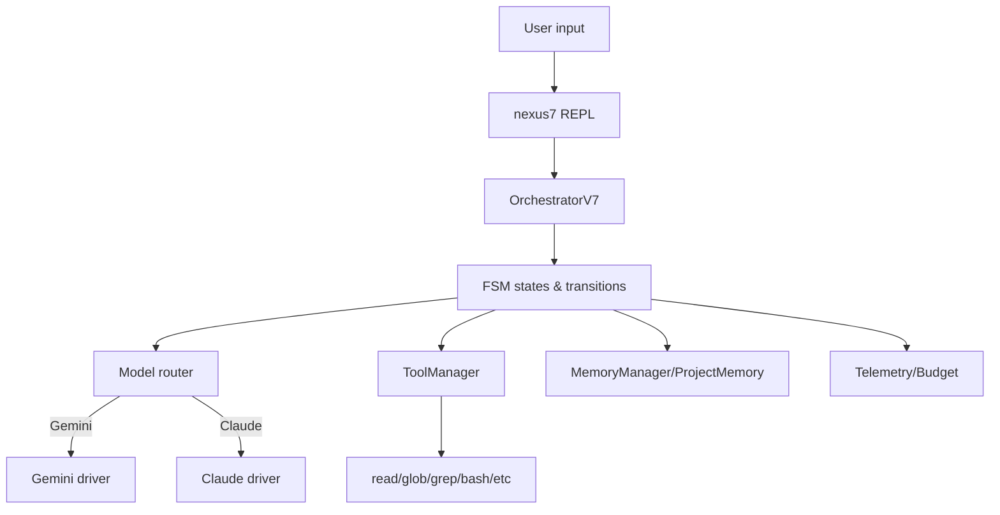

# NEXUS / branche `NX-CG` — Analyse (V12.4) + plan d’actions “what next” (pour Claude Code 4.6 Opus)

**Date de l’analyse : 17 février 2026 (Europe/Paris).**  
**Cible :** donner ce document à *Claude Code 4.6 Opus* pour qu’il puisse corriger/industrialiser rapidement la branche `NX-CG`.

---

## 0) Ce que j’ai observé (snapshot factuel)

### Version & positionnement
- Le repo se présente comme **NEXUS V12.4 “COGNITIVE BOOST”**, avec une ambition de *collaborative intelligence core* (Gemini + Claude en binôme).  
- Packaging Python moderne via `pyproject.toml` (scripts `nexus`, `nexus-research`, `nexus-mcp`) + dépendances RAG/Redis/FastAPI/OTel optionnel + extension Rust optionnelle.  
- Produits mis en avant :
  - **Flagship :** “Research CLI + Evidence Pack” (génération d’artefacts traçables)
  - **Companion :** **MCP Server** (exposer recherche + evidence pack à des clients MCP)

### Capacité “Evolution” (au sens Darwin / auto-amélioration)
Le repo contient une *vraie* colonne vertébrale d’évolution :
- Phases (brainstorm → create → validate → promote)
- Validation fail-fast multi-tiers (incluant **fitness déterministe** AST/pytest/ruff)
- Traçabilité (birth certificate signé, lineage)
- Outils d’exploitation : **MutationTracker**, **StrategyPerformanceTracker**, **AutoSpecializer**, **AgentReaper**

---

## 1) Cartographie récursive des mécanismes (approche “système”)

> Objectif : que Claude comprenne “qui appelle quoi”, et où sont les points de vérité.

### 1.1 Entrypoints (exécution)
- `nexus7.py` : REPL / console interactive (orchestration persistante)
- `nexus_research.py` : CLI “research + evidence pack”
- `core/mcp/server.py` : serveur MCP (tools `nexus_read`, `nexus_grep`, `nexus_analyze`, `nexus_research`, `nexus_export_evidence_pack`, etc.)
- `__main__.py` : bootstrap/entry (à vérifier localement)

**Implication :** le repo est déjà un “produit” (au moins 2) et pas seulement un codebase expérimental.

---

### 1.2 Noyau d’orchestration (runtime)
Conceptuellement, l’exécution REPL ressemble à :



**Points clés :**
- Le routeur modèle + drivers sont au cœur de la “collaboration” (Gemini ↔ Claude).
- Les outils (ToolManager) servent à agir sur le système (lecture fichiers, shell…).
- La mémoire “project memory” sert à l’indexation et à la recherche locale.
- Telemetry/Budget vise à rendre l’usage mesurable et contrôlé.

---

### 1.3 Pipeline “Evolution” (auto-amélioration)
Le pipeline voulu ressemble à :

```mermaid
flowchart LR
  Trigger[Trigger: /evolve ou auto après N tours] --> Brainstorm[BrainstormPhase]
  Brainstorm --> Proposals[Mutation proposals (SEARCH/REPLACE etc)]
  Proposals --> Create[CreatePhase: clone parent + apply mutations + birth cert]
  Create --> Validate[Tiered validation]
  Validate -->|pass| Winner[Pick winner]
  Validate -->|fail| Archive[Archive rejected children]
  Winner --> Promote[PromotePhase: archive parent + move winner + update lineage]
  Promote --> Done[New parent active]
```

**Sous-systèmes associés :**
- `MutationTracker` : généalogie mutations parent→enfant + performances.
- `StrategyPerformanceTracker` : quelles stratégies de mutation marchent par domaine.
- `AutoSpecializer` : déclenche des propositions de spécialistes si domaine > seuil de réussite.
- `AgentReaper` : GC d’agents (importance DyLAN, inactivité, taux de succès).

---

## 2) Ce qui a “évolué” (par rapport à une branche NEXUS plus ancienne)

### 2.1 Passage à une distribution Python “installable”
Le `pyproject.toml` montre un vrai produit packagé :
- scripts CLI (`nexus`, `nexus-research`, `nexus-mcp`)
- extras (`sdk`, `otel`, `rust`, `dev`)
- configuration lint/test (ruff, mypy, pytest, markers)
- maturin configuré pour l’extension Rust

➡️ C’est une évolution majeure : tu peux viser PyPI + releases reproductibles.

---

### 2.2 Drivers SDK + prompt caching (côté ambition)
Le repo assume un mode driver `auto|sdk|cli` et mentionne “Prompt caching” côté SDK.

**À vérifier/aligner :**
- Les IDs de modèles configurés (Claude/Gemini) doivent correspondre à des IDs réellement supportés.
- Les stratégies de cache doivent être cohérentes avec les SDK officiels.

---

### 2.3 MCP “first-class”
`core/mcp/server.py` implémente un serveur MCP basé sur `FastMCP`, exposant des tools NEXUS à des clients externes (Claude Desktop, VSCode, etc.).  
C’est un énorme levier “go-to-market” : **NEXUS devient un outil plug-and-play** dans d’autres agents/IDE.

---

### 2.4 Evolution : fitness déterministe + instrumentation
`TieredValidator` intègre une tier 3 “DeterministicFitnessValidator” basée sur `ruff` + `pytest` + hashing.  
Cela va dans le bon sens : éviter LLM-as-judge (biais, variance) et produire un verdict reproductible.

---

## 3) Diagnostic critique (ce qui manque / ce qui casse)

Je liste ici **ce qui empêche la solution d’être réellement fonctionnelle** “end-to-end” (en particulier l’évolution).

### 3.1 Incohérences d’interface dans `EvolutionManager` (P0 bloquant)
Symptômes probables :
- `EvolutionManager` instancie `TieredValidator(workspace_path, config)` alors que `TieredValidator` est construit pour un **child_path**.
- `EvolutionManager.validate_children()` appelle `self.validator.validate_child(...)` alors que `TieredValidator` expose `run_tiered()` (et pas `validate_child`).
- `EvolutionManager.evaluate_fitness()` appelle `run_benchmarks(child_path)` mais la signature de `run_benchmarks()` attend `nexus_path, nexus_id, benchmark_suite`.
- `EvolutionManager` appelle `compare_to_parent(benchmark_result, parent_id)` mais `compare_to_parent(parent_results, child_results)` attend deux dicts.

➡️ **Conclusion :** la boucle d’évolution (en l’état) a de fortes chances de casser au runtime, ou d’être “non utilisée” (code mort).

**Action :** unifier les interfaces : `EvolutionManager` doit parler à `TieredValidator` via une API stable (voir plan §4).

---

### 3.2 Paramètres config “auto-promotion” incohérents (P0)
- `Config` expose `auto_promotion_enabled` + `auto_promote_improvement_pct`.
- `EvolutionManager` cherche `auto_promotion` et `auto_promote_pct`.

➡️ Résultat : **auto-promotion toujours OFF** même si `.env` l’active.

---

### 3.3 `LINEAGE.json` & résolution de chemins (P0/P1)
- Le code lineage a une logique de chemin très fragile (parent.parent, etc.).  
- Le `LINEAGE.json` présent dans le repo est ancien (V7) et mélange `asi_proximity_score` vs `fitness_score`.

➡️ Risque : promotion/archivage/chargement lineage cassé selon l’emplacement réel (repo root vs parent directory).

---

### 3.4 README/Quickstart vs packaging (P1)
Le README indique une installation via `requirements.txt`, alors que la source de vérité des dépendances est `pyproject.toml`.  
➡️ Risque : installation “dégradée” / drift des deps.

---

### 3.5 Surfaces “à valider” localement (P1)
Je n’ai pas pu lister certains dossiers via l’interface GitHub (limites outil), donc **Claude doit vérifier localement** :
- `tests/` : quels tests couvrent vraiment l’évolution ? (on veut au minimum un “smoke” end-to-end)
- `interface/ui/cerebro` : statut réel (prototype ?)
- `agent_card.json` : contenu A2A / agent card v0.3.0 (et où il est consommé)

---

## 4) Plan d’actions recommandé (priorisé)

### P0 — Rendre la boucle “Evolution” réellement exécutable (end-to-end)
Objectif : `nexus7` → `/evolve 1` doit aller jusqu’au bout (même sans auto-promo), sur une machine de dev.

#### 4.1 Définir l’API contractuelle de validation
**Décision recommandée :** `TieredValidator` devient la source de vérité.
- Input : `child_path`, `config`, `max_tier`
- Output : objet/struct `TieredResult` (success, tier_reached, fitness_score, errors, timings, hashes, etc.)

**Travail :**
- Adapter `EvolutionManager.validate_children()` :
  - pour chaque child:
    - `validator = TieredValidator(child_path, config)`
    - `result = validator.run_tiered(max_tier=config.validation_tier_default)`
    - stocker `result` dans `child_results`

#### 4.2 Supprimer / isoler l’ancien evaluator V7.5
Deux options propres :
1) **Option A (simple) :** conserver `core/evolution/evaluator.py` mais ne plus l’appeler en prod.
2) **Option B (clean) :** refactor : `evaluator.py` devient backend optionnel (si `features.evolution_llm_judge=True`), sinon on suit la voie déterministe.

#### 4.3 Fixer l’auto-promotion
- Remplacer `getattr(config, 'auto_promotion', False)` par `config.auto_promotion_enabled`
- Remplacer `config.auto_promote_pct` par `config.auto_promote_improvement_pct`

#### 4.4 Stabiliser `LineageManager` (chemins + schéma)
**Décision à prendre :** où vit le lineage ?
- Option 1 : dans `WORKSPACE_PATH/.nexus/LINEAGE.json` (recommandé pour l’installable)
- Option 2 : dans `<project_root>/LINEAGE.json` (pour mode “monorepo evolution lab”)

**Implémentation recommandée :**
- Ajouter dans config : `LINEAGE_PATH` (absolu ou relatif à workspace)
- `load_lineage(path=...)` doit être trivial (pas de heuristiques parent.parent)
- Migration : un script `scripts/migrate_lineage_v7_to_v12.py`

#### 4.5 Ajouter un test smoke “Evolution”
Créer `tests/integration/test_evolution_smoke.py` :
- créer un workspace temporaire
- lancer `EvolutionManager.run_evolution_cycle(child_count=1)` avec orchestrator mock (ou mode “dry-run”)
- vérifier : un child est créé, validé (tier1/tier2 minimal), et archivé si fail.

---

### P1 — Stabilisation produit (install + CLI + docs)
#### 4.6 Aligner Quickstart sur `pyproject`
- Remplacer `pip install -r requirements.txt` par :
  - `pip install -e ".[dev,sdk]"` (ou `.[sdk]` si usage minimal)
- Ajouter `requirements.txt` généré automatiquement si tu veux (mais non source de vérité).

#### 4.7 Ajouter une commande `/doctor` robuste
Tu as déjà un `--verify` : consolider en un diagnostic unique :
- vérif `WORKSPACE_PATH` accessible
- vérif drivers (SDK keys ou CLI)
- vérif `redis` si `USE_REDIS_WORKFLOWS=True`
- vérif `mcp` si serveur MCP lancé
- vérif `ruff`/`pytest` si `USE_TIERED_VALIDATION=True`

---

### P2 — Observabilité & gouvernance
#### 4.8 OTel “real” (si `NEXUS_FF_OTEL_ENABLED=true`)
- Ajouter exporter OTLP configurable
- Instrumenter les drivers (Claude/Gemini) + tools + pipeline evolution

#### 4.9 Security hardening
- Vérifier que `MutationValidator` est bien “fail-closed” selon le flag `kernel_fail_closed`.
- Ajouter un “dangerous shell patterns” test (rm -rf, curl|bash, etc.)

---

## 5) Recommandations “Produit / Potentiel”
### 5.1 Angle produit le plus crédible à court terme
**Research CLI + Evidence Pack** + **MCP server** → c’est la meilleure wedge :
- valeur immédiate (artefacts traçables)
- différenciation (local-first + preuves)
- intégration simple (MCP)

### 5.2 Différenciation long terme
Le “holy grail” NEXUS :
- pipeline d’évolution *déterministe*, traçable, safe
- auto-spécialisation (par domaines)
- gestion de cycle de vie des agents (reaper)
- scale-out (Redis workflows)

Mais ça ne vaut que si la boucle “evolve → validate → promote” est béton.

---

## 6) Instructions directes pour Claude Code 4.6 Opus (copier-coller)

### Mission
1) **Faire passer la boucle d’évolution en P0** : plus de mismatch d’API, plus de chemins fragiles.
2) Ajouter un test smoke pour garantir que ça ne régresse pas.
3) Aligner config + README + packaging.

### Checklist d’exécution (Claude)
- [ ] Lire `core/evolution/manager.py` et repérer les appels incompatibles (TieredValidator, evaluator, lineage)
- [ ] Refactor `EvolutionManager` pour utiliser `TieredValidator(child_path).run_tiered()`
- [ ] Corriger auto-promotion (config attrs)
- [ ] Introduire `LINEAGE_PATH` (ou décider workspace-based lineage)
- [ ] Ajouter test smoke
- [ ] Mettre à jour README quickstart (pyproject)

### Commandes de validation (local)
- `python -m pip install -e ".[dev,sdk]"`  
- `python nexus7.py --verify`  
- `pytest -q -m "not slow" --maxfail=1`  
- `python -m core.mcp.server` (si `pip install mcp`)  

---

## 7) Critères d’acceptation (Definition of Done)
- `/evolve 1` fonctionne en REPL (au moins jusqu’à validation tier2, sans crash).
- `pytest -m "not slow"` passe sur un environnement dev standard.
- `nexus-mcp` démarre et répond à `nexus_status` + `nexus_memory_search`.
- Le stockage lineage est **déterministe** et documenté (pas de heuristiques parent.parent).

---

## 8) Notes (hypothèses)
- Certains dossiers/fichiers doivent être inspectés localement (limitations de listing GitHub côté outil).  
- Les IDs de modèles Claude/Gemini doivent être **vérifiés** et probablement externalisés via `.env` (plutôt que hardcodés).

