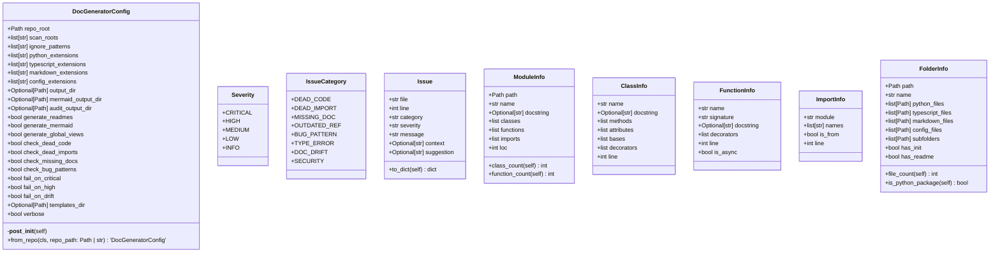

# doc_generator

Automated documentation generator for NEXUS.

Features:
    - AST-based code analysis (Python, TypeScript)
    - Mermaid diagram generation
    - README generation with Jinja2 templates
    - Hierarchical aggregation (child -> parent -> workflows)
    - Consistency checking and bug pattern detection
    - CI/CD integration with drift detection

Usage:
    python -m tools.doc_generator generate --all
    python -m tools.doc_generator audit --output audit/
    python -m tools.doc_generator check --fail-on critical

## Overview

| Metric | Value |
|--------|-------|
| **Path** | `C:\Code\NEXUS\NEXUS-N7A\tools\doc_generator` |
| **Modules** | 3 |
| **Total Lines** | 629 |
| **Classes** | 9 |
| **Functions** | 6 |

## Architecture

## Modules

| Module | Description | Classes | Functions |
|--------|-------------|---------|-----------|
| [__main__](__main__.py) | Command-line interface for the documentation generator. | 0 | 6 |
| [config](config.py) | Configuration for the documentation generator. | 9 | 0 |

## Subpackages

| Package | Description | Modules |
|---------|-------------|---------|
| [analyzer/](C:\Code\NEXUS\NEXUS-N7A\tools\doc_generator\analyzer/README.md) |  | 0 |
| [generators/](C:\Code\NEXUS\NEXUS-N7A\tools\doc_generator\generators/README.md) |  | 0 |
| [reporters/](C:\Code\NEXUS\NEXUS-N7A\tools\doc_generator\reporters/README.md) |  | 0 |
| [scanner/](C:\Code\NEXUS\NEXUS-N7A\tools\doc_generator\scanner/README.md) |  | 0 |
| [templates/](C:\Code\NEXUS\NEXUS-N7A\tools\doc_generator\templates/README.md) |  | 0 |
| [validators/](C:\Code\NEXUS\NEXUS-N7A\tools\doc_generator\validators/README.md) |  | 0 |

## Aggregated Statistics

Statistics from all subpackages:

| Metric | Value |
|--------|-------|
| Subpackages | 6 |
| Total Modules | 0 |
| Total Lines of Code | 0 |
| Total Classes | 0 |
| Total Functions | 0 |

---
*Auto-generated by nexus-doc-generator 1.0.0 - 2025-12-16 19:13*