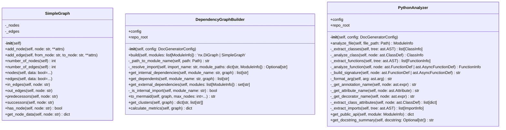

# analyzer

Code analysis using AST parsing.

Classes:
    PythonAnalyzer: Analyzes Python files using ast module
    TypeScriptAnalyzer: Analyzes TypeScript files
    DependencyGraphBuilder: Builds import dependency graph
    MetricsExtractor: Extracts code metrics (LOC, complexity)

## Overview

| Metric | Value |
|--------|-------|
| **Path** | `C:\Code\NEXUS\NEXUS-N7A\tools\doc_generator\analyzer` |
| **Modules** | 3 |
| **Total Lines** | 604 |
| **Classes** | 3 |
| **Functions** | 0 |

## Architecture

## Modules

| Module | Description | Classes | Functions |
|--------|-------------|---------|-----------|
| [dependency_graph](dependency_graph.py) | Builds import dependency graphs using networkx. | 2 | 0 |
| [python_analyzer](python_analyzer.py) | Analyzes Python files using the ast module. | 1 | 0 |

---
*Auto-generated by nexus-doc-generator 1.0.0 - 2025-12-16 19:13*