# generators

Documentation generation using Jinja2 templates.

Classes:
    ReadmeGenerator: Generates README.md files for folders
    MermaidGenerator: Generates Mermaid diagrams
    DocumentAggregator: Aggregates child docs to parent docs
    GlobalViewGenerator: Generates global architecture views

## Overview

| Metric | Value |
|--------|-------|
| **Path** | `C:\Code\NEXUS\NEXUS-N7A\tools\doc_generator\generators` |
| **Modules** | 5 |
| **Total Lines** | 1074 |
| **Classes** | 4 |
| **Functions** | 0 |

## Architecture

```mermaid
classDiagram
    class DocumentAggregator {
        +config
        -__init__(self, config: DocGeneratorConfig)
        +aggregate(self, folders: list[FolderInfo], modules: list[ModuleInfo]) None
        -_build_hierarchy(self, folders: list[FolderInfo]) dict[str, FolderInfo]
        -_aggregate_folder(self, folder: FolderInfo, hierarchy: dict[str, FolderInfo], modules: list[ModuleInfo], processed: set[str]) None
        -_get_folder_modules(self, folder: FolderInfo, modules: list[ModuleInfo]) list[ModuleInfo]
        -_update_folder_summary(self, folder: FolderInfo, children: list[FolderInfo], total_modules: int, total_loc: int, total_classes: int, total_functions: int) None
        -_create_stats_section(self, children: list[FolderInfo], total_modules: int, total_loc: int, total_classes: int, total_functions: int) list[str]
        +get_folder_summary(self, folder: FolderInfo, modules: list[ModuleInfo]) dict
    }
    class GlobalViewGenerator {
        +config
        +mermaid_gen
        -__init__(self, config: DocGeneratorConfig)
        +generate(self, modules: list[ModuleInfo], dep_graph, folders: list[FolderInfo]) None
        -_generate_architecture(self, modules: list[ModuleInfo], dep_graph, folders: list[FolderInfo], output_dir: Path) None
        -_generate_overview_diagram(self, folders: list[FolderInfo]) str
        -_generate_hierarchy_diagram(self, folders: list[FolderInfo]) str
        -_generate_workflow_map(self, modules: list[ModuleInfo], output_dir: Path) None
        -_get_core_modules(self, folders: list[FolderInfo], modules: list[ModuleInfo]) list[dict]
        -_calculate_stats(self, modules: list[ModuleInfo], folders: list[FolderInfo]) dict
    }
    class MermaidGenerator {
        +config
        -__init__(self, config: DocGeneratorConfig)
        +generate_all(self, modules: list[ModuleInfo], dep_graph) None
        +class_diagram(self, classes: list[ClassInfo]) str
        +class_diagram_from_modules(self, modules: list[ModuleInfo], max_classes: int=...) str
        +flowchart(self, nodes: list[dict], edges: list[dict], direction: str=...) str
        +sequence_diagram(self, participants: list[dict], steps: list[dict]) str
        +state_diagram(self, states: list[dict], transitions: list[dict]) str
        +module_diagram(self, folder_path: Path, modules: list[ModuleInfo]) str
        +generate_for_folder(self, folder_path: Path, classes: list[ClassInfo]) Optional[str]
    }
    class ReadmeGenerator {
        +config
        +mermaid_gen
        +env
        -__init__(self, config: DocGeneratorConfig)
        +generate_for_folder(self, folder: FolderInfo, all_modules: list[ModuleInfo], dep_graph) None
        -_module_in_folder(self, module: ModuleInfo, folder_path: Path) bool
        -_generate_package_readme(self, folder: FolderInfo, modules: list[ModuleInfo], dep_graph) str
        -_generate_simple_readme(self, folder: FolderInfo, modules: list[ModuleInfo]) str
        -_generate_simple_package_readme(self, folder: FolderInfo, modules: list[ModuleInfo], docstring: Optional[str], total_loc: int, total_classes: int, total_functions: int, class_diagram: Optional[str]) str
        -_get_summary(self, docstring: Optional[str]) str
        -_render_template(self, template_name: str, context: dict) str
    }
```

## Modules

| Module | Description | Classes | Functions |
|--------|-------------|---------|-----------|
| [aggregator](aggregator.py) | Aggregates documentation from child folders to parent folders. | 1 | 0 |
| [global_views](global_views.py) | Generates global architecture views and documentation. | 1 | 0 |
| [mermaid_generator](mermaid_generator.py) | Generates Mermaid diagrams from code analysis. | 1 | 0 |
| [readme_generator](readme_generator.py) | Generates README.md files using Jinja2 templates. | 1 | 0 |

---
*Auto-generated by nexus-doc-generator 1.0.0 - 2025-12-16 19:13*