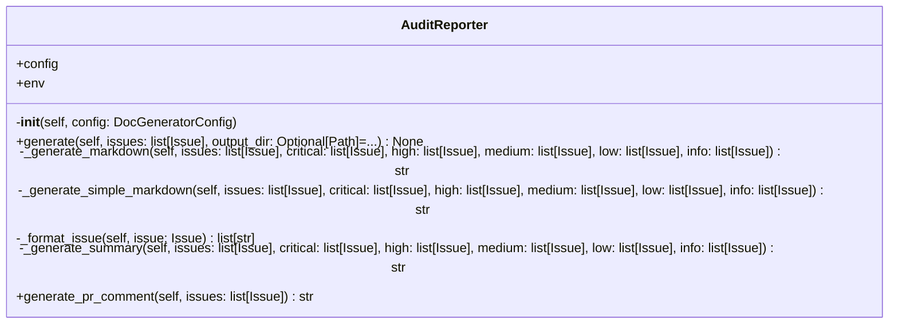

# reporters

Report generation for audits and coverage.

Classes:
    AuditReporter: Generates audit reports in Markdown
    CoverageReporter: Generates documentation coverage reports
    DiffReporter: Generates diff reports since last run

## Overview

| Metric | Value |
|--------|-------|
| **Path** | `C:\Code\NEXUS\NEXUS-N7A\tools\doc_generator\reporters` |
| **Modules** | 2 |
| **Total Lines** | 345 |
| **Classes** | 1 |
| **Functions** | 0 |

## Architecture

## Modules

| Module | Description | Classes | Functions |
|--------|-------------|---------|-----------|
| [audit_reporter](audit_reporter.py) | Generates audit reports in Markdown format. | 1 | 0 |

---
*Auto-generated by nexus-doc-generator 1.0.0 - 2025-12-16 19:13*