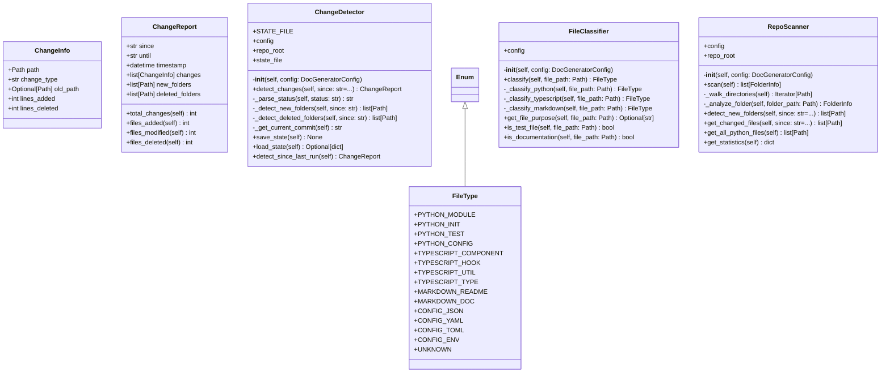

# scanner

Repository scanning and file discovery.

Classes:
    RepoScanner: Scans repository for all folders and files
    FileClassifier: Classifies files by type (Python, TypeScript, etc.)
    ChangeDetector: Detects changes since last commit

## Overview

| Metric | Value |
|--------|-------|
| **Path** | `C:\Code\NEXUS\NEXUS-N7A\tools\doc_generator\scanner` |
| **Modules** | 4 |
| **Total Lines** | 608 |
| **Classes** | 6 |
| **Functions** | 0 |

## Architecture

## Modules

| Module | Description | Classes | Functions |
|--------|-------------|---------|-----------|
| [change_detector](change_detector.py) | Detects changes in the repository since last run or commit. | 3 | 0 |
| [file_classifier](file_classifier.py) | Classifies files by type and purpose. | 2 | 0 |
| [repo_scanner](repo_scanner.py) | Scans repository for all folders and files with auto-discovery. | 1 | 0 |

---
*Auto-generated by nexus-doc-generator 1.0.0 - 2025-12-16 19:13*