# validators

Code validation and issue detection.

Classes:
    ConsistencyChecker: Checks for dead imports, missing docs, etc.
    DeadCodeDetector: Detects unused code
    DocDriftDetector: Detects outdated documentation
    BugPatternDetector: Detects suspicious code patterns

## Overview

| Metric | Value |
|--------|-------|
| **Path** | `C:\Code\NEXUS\NEXUS-N7A\tools\doc_generator\validators` |
| **Modules** | 5 |
| **Total Lines** | 979 |
| **Classes** | 4 |
| **Functions** | 0 |

## Architecture

```mermaid
classDiagram
    class BugPatternDetector {
        +PATTERNS
        +config
        -__init__(self, config: DocGeneratorConfig)
        +scan(self, file_path: str, code: str) list[Issue]
        -_scan_pattern(self, file_path: str, lines: list[str], pattern_name: str, pattern: str, severity: str, message: str, suggestion: Optional[str]) list[Issue]
        -_strip_strings(self, line: str) str
        +get_severity_counts(self, issues: list[Issue]) dict[str, int]
        +scan_file(self, file_path: str) list[Issue]
    }
    class ConsistencyChecker {
        +config
        -__init__(self, config: DocGeneratorConfig)
        +check(self, modules: list[ModuleInfo]) list[Issue]
        -_build_module_index(self, modules: list[ModuleInfo]) set[str]
        -_check_dead_imports(self, module: ModuleInfo, module_index: set[str]) list[Issue]
        -_is_internal_import(self, module_name: str) bool
        -_import_exists(self, module_name: str, module_index: set[str]) bool
        -_check_missing_docs(self, module: ModuleInfo) list[Issue]
        -_check_type_hints(self, module: ModuleInfo) list[Issue]
    }
    class DeadCodeDetector {
        +config
        -__init__(self, config: DocGeneratorConfig)
        +detect(self, modules: list[ModuleInfo]) list[Issue]
        -_build_usage_index(self, modules: list[ModuleInfo]) dict[str, int]
        -_check_unused_functions(self, module: ModuleInfo, usage_index: dict[str, int]) list[Issue]
        -_check_unused_classes(self, module: ModuleInfo, usage_index: dict[str, int]) list[Issue]
        -_check_unused_imports(self, module: ModuleInfo) list[Issue]
        +find_orphan_files(self, modules: list[ModuleInfo]) list[Issue]
    }
    class DocDriftDetector {
        +config
        -__init__(self, config: DocGeneratorConfig)
        +detect(self) list[Issue]
        -_check_readme_drift(self) list[Issue]
        -_check_version_drift(self) list[Issue]
        -_get_current_version(self) Optional[str]
        -_version_is_older(self, doc_version: str, current_version: str) bool
        -_check_broken_links(self) list[Issue]
        +check_since_commit(self, commit: str) list[Issue]
    }
```

## Modules

| Module | Description | Classes | Functions |
|--------|-------------|---------|-----------|
| [bug_pattern_detector](bug_pattern_detector.py) | Detects suspicious code patterns that may indicate bugs. | 1 | 0 |
| [consistency_checker](consistency_checker.py) | Checks for code consistency issues like dead imports, missing docs, etc. | 1 | 0 |
| [dead_code_detector](dead_code_detector.py) | Detects potentially unused code (functions, classes, imports). | 1 | 0 |
| [doc_drift_detector](doc_drift_detector.py) | Detects when documentation is out of sync with code. | 1 | 0 |

---
*Auto-generated by nexus-doc-generator 1.0.0 - 2025-12-16 19:13*